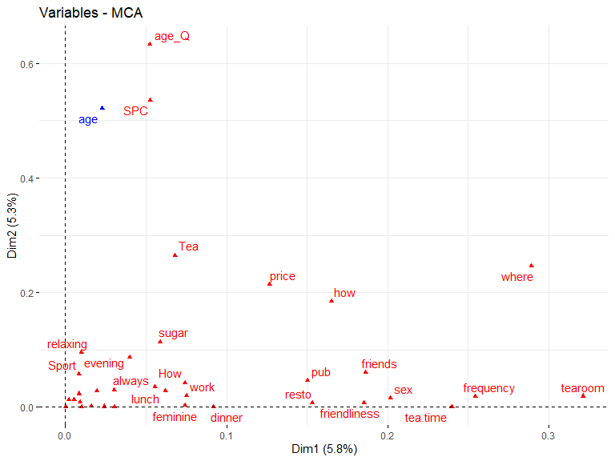
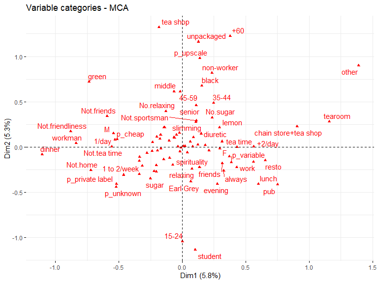
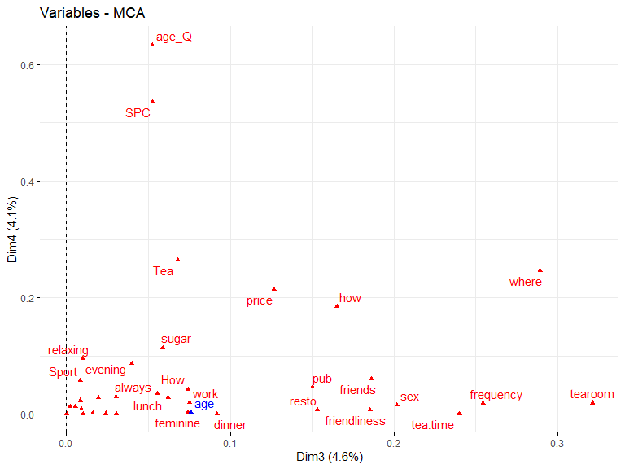
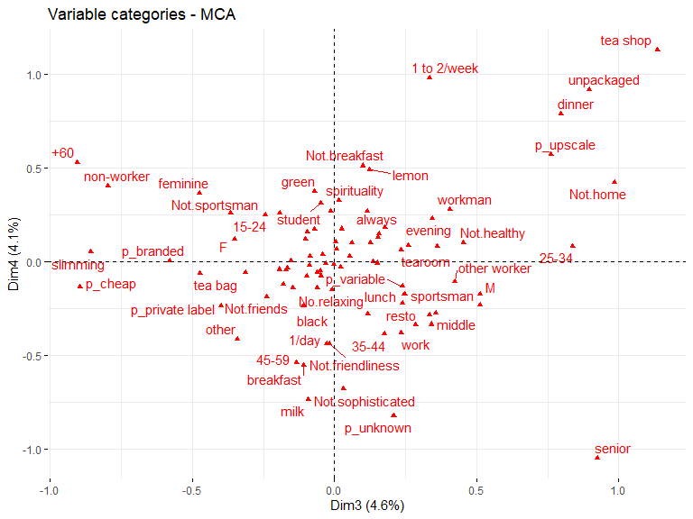
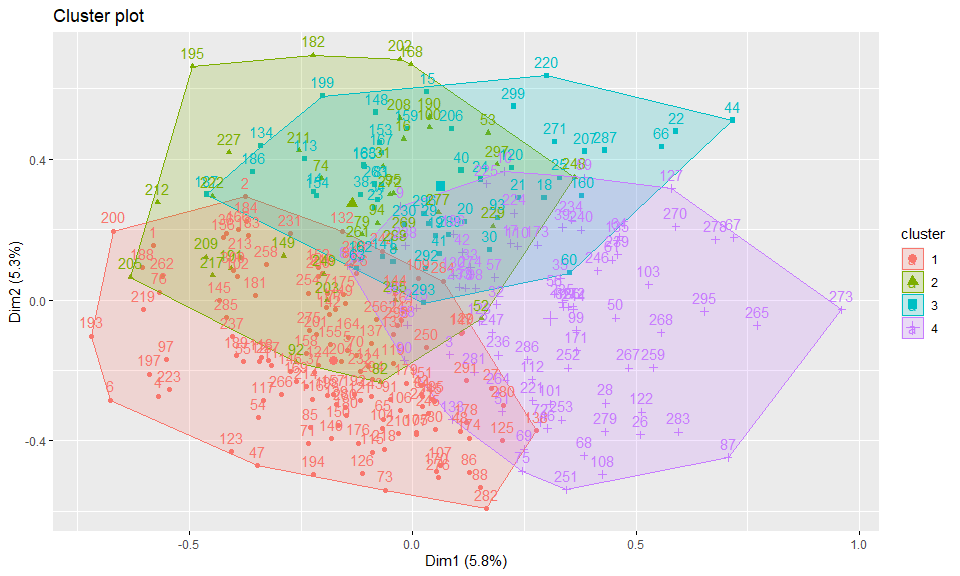
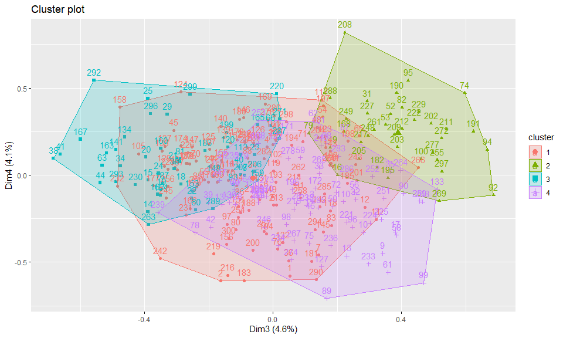

    library(FactoMineR)
    data("tea")

# Statistiques descriptives

Nous pouvons dénombrer le nombre d’observations et de colonnes
(variables) du jeu de données en utilisant la fonction `str()` dans R.

    str(tea)

    'data.frame':   300 obs. of  36 variables:
     $ breakfast       : Factor w/ 2 levels "breakfast","Not.breakfast": 1 1 2 2 1 2 1 2 1 1 ...
     $ tea.time        : Factor w/ 2 levels "Not.tea time",..: 1 1 2 1 1 1 2 2 2 1 ...
     $ evening         : Factor w/ 2 levels "evening","Not.evening": 2 2 1 2 1 2 2 1 2 1 ...
     $ lunch           : Factor w/ 2 levels "lunch","Not.lunch": 2 2 2 2 2 2 2 2 2 2 ...
     $ dinner          : Factor w/ 2 levels "dinner","Not.dinner": 2 2 1 1 2 1 2 2 2 2 ...
     $ always          : Factor w/ 2 levels "always","Not.always": 2 2 2 2 1 2 2 2 2 2 ...
     $ home            : Factor w/ 2 levels "home","Not.home": 1 1 1 1 1 1 1 1 1 1 ...
     $ work            : Factor w/ 2 levels "Not.work","work": 1 1 2 1 1 1 1 1 1 1 ...
     $ tearoom         : Factor w/ 2 levels "Not.tearoom",..: 1 1 1 1 1 1 1 1 1 2 ...
     $ friends         : Factor w/ 2 levels "friends","Not.friends": 2 2 1 2 2 2 1 2 2 2 ...
     $ resto           : Factor w/ 2 levels "Not.resto","resto": 1 1 2 1 1 1 1 1 1 1 ...
     $ pub             : Factor w/ 2 levels "Not.pub","pub": 1 1 1 1 1 1 1 1 1 1 ...
     $ Tea             : Factor w/ 3 levels "black","Earl Grey",..: 1 1 2 2 2 2 2 1 2 1 ...
     $ How             : Factor w/ 4 levels "alone","lemon",..: 1 3 1 1 1 1 1 3 3 1 ...
     $ sugar           : Factor w/ 2 levels "No.sugar","sugar": 2 1 1 2 1 1 1 1 1 1 ...
     $ how             : Factor w/ 3 levels "tea bag","tea bag+unpackaged",..: 1 1 1 1 1 1 1 1 2 2 ...
     $ where           : Factor w/ 3 levels "chain store",..: 1 1 1 1 1 1 1 1 2 2 ...
     $ price           : Factor w/ 6 levels "p_branded","p_cheap",..: 4 6 6 6 6 3 6 6 5 5 ...
     $ age             : int  39 45 47 23 48 21 37 36 40 37 ...
     $ sex             : Factor w/ 2 levels "F","M": 2 1 1 2 2 2 2 1 2 2 ...
     $ SPC             : Factor w/ 7 levels "employee","middle",..: 2 2 4 6 1 6 5 2 5 5 ...
     $ Sport           : Factor w/ 2 levels "Not.sportsman",..: 2 2 2 1 2 2 2 2 2 1 ...
     $ age_Q           : Factor w/ 5 levels "15-24","25-34",..: 3 4 4 1 4 1 3 3 3 3 ...
     $ frequency       : Factor w/ 4 levels "1/day","1 to 2/week",..: 1 1 3 1 3 1 4 2 3 3 ...
     $ escape.exoticism: Factor w/ 2 levels "escape-exoticism",..: 2 1 2 1 1 2 2 2 2 2 ...
     $ spirituality    : Factor w/ 2 levels "Not.spirituality",..: 1 1 1 2 2 1 1 1 1 1 ...
     $ healthy         : Factor w/ 2 levels "healthy","Not.healthy": 1 1 1 1 2 1 1 1 2 1 ...
     $ diuretic        : Factor w/ 2 levels "diuretic","Not.diuretic": 2 1 1 2 1 2 2 2 2 1 ...
     $ friendliness    : Factor w/ 2 levels "friendliness",..: 2 2 1 2 1 2 2 1 2 1 ...
     $ iron.absorption : Factor w/ 2 levels "iron absorption",..: 2 2 2 2 2 2 2 2 2 2 ...
     $ feminine        : Factor w/ 2 levels "feminine","Not.feminine": 2 2 2 2 2 2 2 1 2 2 ...
     $ sophisticated   : Factor w/ 2 levels "Not.sophisticated",..: 1 1 1 2 1 1 1 2 2 1 ...
     $ slimming        : Factor w/ 2 levels "No.slimming",..: 1 1 1 1 1 1 1 1 1 1 ...
     $ exciting        : Factor w/ 2 levels "exciting","No.exciting": 2 1 2 2 2 2 2 2 2 2 ...
     $ relaxing        : Factor w/ 2 levels "No.relaxing",..: 1 1 2 2 2 2 2 2 2 2 ...
     $ effect.on.health: Factor w/ 2 levels "effect on health",..: 2 2 2 2 2 2 2 2 2 2 ...

Il y a 300 observations et 36 colonnes dans ce jeu de données.

La grande partie des colonnes est reconnue par R comme des données
variables contenant des modalités discrètes, c’est pour cela que le type
des colonnes est Factor.

Etant donnée que R a bien reconnu ces types de colonnes, il nous est
possible de compter le nombre des modalités de chaque colonnes en
utilisant soit la fonction `summary()`, soit la fonction `table()`.

Par exemple si on veut savoir combien de perosnnes prennent leur thé
avec du sucre, il suffit d’utiliser la fonction l’une des fonctions
suivantes.

    table(tea$sugar)

    No.sugar    sugar 
         155      145 

On voit que 155 personnes ont déclaré ne pas prendre leur thé avec du
sucre, tandis que 145 ont déclaré en prendre avec du sucre.

Le résultat est le même si on utilise la fonction `summary()`

    summary(tea$sugar)

    No.sugar    sugar 
         155      145 

# Tableaux croisés (tableau de contingence)

Il est aussi facile de produire des tableaux de contingence avec la
fonction `table()`. Le tableau de contingence nous permet de croiser les
modalités de deux colonnes afin de compter la fréquence conditionnelle.

Par exemple parmi les personnes qui boivent leur thé avec du sucre,
combien le boivent à la maison ?

    table(tea$sugar, tea$home)

              
               home Not.home
      No.sugar  153        2
      sugar     138        7

Parmi les personnes qui boivent le thé chez eux (home), 153 boivent sans
sucre.

# Analyse des correspondances multiples

    library(FactoMineR)
    var_quanti_illustrative <- c("age")
    idx_var_quanti_illustrative <- match(var_quanti_illustrative, colnames(tea))
    acm <- MCA(tea, quanti.sup = idx_var_quanti_illustrative, graph = FALSE)

## Nombre de composantes à retenir

Contrairement à l’ACP, la règle de Kaiser ne s’applique pas pour une
analyse des correspondances multiples. Le choix du nombre de composantes
dépend du pourcentage de l’inertie expliquée qu’on estime satisfaisant.

Le tableau suivant affiche le pourcentage de la variance expliquée par
chaque axe. La dernière colonne du tableau affiche le pourcentage cumulé
de variance expliquée par nombre de composantes. Si l’on retient 4
composantes dans l’analyse alors on arriverait à expliquer 19.7383 % de
la variance totale.

    acm$eig

           eigenvalue percentage of variance cumulative percentage of variance
    dim 1    0.090068                 5.8378                             5.838
    dim 2    0.081654                 5.2924                            11.130
    dim 3    0.070214                 4.5509                            15.681
    dim 4    0.062597                 4.0572                            19.738
    dim 5    0.055787                 3.6158                            23.354
    dim 6    0.053455                 3.4647                            26.819
    dim 7    0.050484                 3.2721                            30.091
    dim 8    0.047679                 3.0903                            33.181
    dim 9    0.047104                 3.0530                            36.234
    dim 10   0.043718                 2.8336                            39.068
    dim 11   0.040775                 2.6428                            41.711
    dim 12   0.040469                 2.6230                            44.334
    dim 13   0.039053                 2.5312                            46.865
    dim 14   0.036838                 2.3877                            49.252
    dim 15   0.035514                 2.3018                            51.554
    dim 16   0.035093                 2.2746                            53.829
    dim 17   0.033506                 2.1717                            56.000
    dim 18   0.032174                 2.0854                            58.086
    dim 19   0.031059                 2.0131                            60.099
    dim 20   0.031023                 2.0108                            62.110
    dim 21   0.029549                 1.9152                            64.025
    dim 22   0.028492                 1.8467                            65.872
    dim 23   0.026838                 1.7395                            67.611
    dim 24   0.026010                 1.6858                            69.297
    dim 25   0.025271                 1.6379                            70.935
    dim 26   0.024831                 1.6094                            72.544
    dim 27   0.024239                 1.5711                            74.115
    dim 28   0.023512                 1.5239                            75.639
    dim 29   0.022518                 1.4595                            77.099
    dim 30   0.021978                 1.4245                            78.523
    dim 31   0.021259                 1.3779                            79.901
    dim 32   0.020397                 1.3220                            81.223
    dim 33   0.019770                 1.2814                            82.504
    dim 34   0.019142                 1.2407                            83.745
    dim 35   0.018849                 1.2217                            84.967
    dim 36   0.017780                 1.1524                            86.119
    dim 37   0.016841                 1.0915                            87.211
    dim 38   0.016536                 1.0718                            88.283
    dim 39   0.015716                 1.0186                            89.301
    dim 40   0.015323                 0.9931                            90.294
    dim 41   0.014657                 0.9500                            91.244
    dim 42   0.014261                 0.9243                            92.169
    dim 43   0.013748                 0.8910                            93.060
    dim 44   0.012848                 0.8328                            93.893
    dim 45   0.012216                 0.7918                            94.684
    dim 46   0.011252                 0.7293                            95.414
    dim 47   0.011051                 0.7163                            96.130
    dim 48   0.010274                 0.6659                            96.796
    dim 49   0.010181                 0.6599                            97.456
    dim 50   0.009328                 0.6046                            98.060
    dim 51   0.009006                 0.5837                            98.644
    dim 52   0.008007                 0.5189                            99.163
    dim 53   0.006897                 0.4470                            99.610
    dim 54   0.006019                 0.3901                           100.000

## Description de chaque composante

Pour la suite de l’étude nous faisons le choix de retenir 4 composantes.
Nous allons expliquer une à une ce que chaque composante mesure. Avec
FactoMiner nous pouvons utiliser la fonction `dimdesc` pour décrire
chaque composante.

La fonction dimdesc produit un nombre variable des tableaux de résultats
selon qu’on a indiqué si des variables sont quantitatives illustratives
ou non.

## Composante 1

Dans notre cas, nous avons choisi la variable `age` comme variable
quantitative illustrative, le premier tableau qui s’intitule **Link
between the variable and the continuous variables (R-square)** affiche
donc le coefficient de corrélation entre l’age et la composante 1. La
valeur du coefficient de corrélation entre l’âge et la composante est :
0,151, cela signifie que l’âge est positivement corrélée avec la
composante 1. Cette valeur peut nous suggérer qu’il y a un lien positif
faible entre l’âge et la composante 1. Les personnes qui ont des
coordonnées positives sur l’axe 1 ont tendance à être plus agés que les
personnes ayant des coordonnées positives.

Le deuxième tableau s’intitule **Link between the variable and the
categorical variable (1-way anova)**, il s’agit d’une analyse de la
variance (anova) à un facteur. Ce tableau contient deux colonnes : la
colonne R2 qui désigne le coefficient de détermination. C’est le pouvoir
explicatif de la variable sur la composante. On interprète le R2 comme
le pouvoir explicatif de la variable sur la variance de la composante 1,
autrement quel pourcentage de l’intertie totale de la composante 1 est
capturée par la variable en question. Par exemple la variable `tearoom`
explique 32% de la variance de la composante 1. La colonne `p.value`
affiche la significativité de ce pouvoir explicatif. Si la valeur p est
inférieure à 0.05 alors on rejette l’hypothèse selon laquelle la
variable considérée n’a aucune influence sur la composante 1.

Le dernier tableau s’intitule **Link between variable and the categories
of the categorical variables**, il s’agit du sens de la relation entre
les modalités des variables et la composante 1.

Le deuxième tableau affiche le pouvoir explicatif de chaque variable sur
la composante 1, le troisème tableau montre le sens des modalités de
cette variable sur la composante 1.

    # Décrire la composante 1
    dimdesc(acm, axes = 1)

    $`Dim 1`

    Link between the variable and the continuous variables (R-square)
    =================================================================================
        correlation  p.value
    age      0.1512 0.008706

    Link between the variable and the categorical variable (1-way anova)
    =============================================
                       R2   p.value
    tearoom       0.32128 6.763e-27
    where         0.28923 9.596e-23
    tea.time      0.23984 1.678e-19
    frequency     0.25442 9.428e-19
    sex           0.20171 2.682e-16
    friends       0.18638 4.741e-15
    friendliness  0.18526 5.833e-15
    resto         0.15327 1.985e-12
    how           0.16529 2.230e-12
    pub           0.15023 3.420e-12
    dinner        0.09182 8.649e-08
    price         0.12656 1.506e-07
    work          0.07535 1.382e-06
    feminine      0.07421 1.671e-06
    lunch         0.06200 1.279e-05
    sugar         0.05894 2.126e-05
    Tea           0.06803 2.859e-05
    always        0.05562 3.687e-05
    How           0.07419 4.328e-05
    evening       0.03985 5.045e-04
    breakfast     0.03054 2.386e-03
    diuretic      0.03028 2.490e-03
    age_Q         0.05234 3.138e-03
    exciting      0.02410 7.055e-03
    SPC           0.05267 1.396e-02
    sophisticated 0.01948 1.556e-02
    home          0.01601 2.846e-02

    Link between variable abd the categories of the categorical variables
    ================================================================
                                    Estimate   p.value
    tearoom=tearoom                  0.21538 6.763e-27
    where=chain store+tea shop       0.23300 1.076e-23
    tea.time=tea time                0.14817 1.678e-19
    frequency=+2/day                 0.20274 7.314e-19
    sex=F                            0.13720 2.682e-16
    friends=friends                  0.13612 4.741e-15
    friendliness=friendliness        0.16355 5.833e-15
    resto=resto                      0.13338 1.985e-12
    pub=pub                          0.14280 3.420e-12
    how=tea bag+unpackaged           0.13337 1.058e-11
    dinner=Not.dinner                0.17822 8.649e-08
    price=p_variable                 0.18331 1.328e-07
    work=work                        0.09077 1.382e-06
    feminine=feminine                0.08257 1.671e-06
    lunch=lunch                      0.10561 1.279e-05
    How=other                        0.30140 1.891e-05
    sugar=No.sugar                   0.07290 2.126e-05
    always=always                    0.07453 3.687e-05
    evening=evening                  0.06309 5.045e-04
    breakfast=breakfast              0.05249 2.386e-03
    diuretic=diuretic                0.05290 2.490e-03
    exciting=No.exciting             0.04784 7.055e-03
    age_Q=+60                        0.09668 1.295e-02
    sophisticated=sophisticated      0.04648 1.556e-02
    home=home                        0.11129 2.846e-02
    SPC=non-worker                   0.10142 3.453e-02
    home=Not.home                   -0.11129 2.846e-02
    How=alone                       -0.14506 1.950e-02
    sophisticated=Not.sophisticated -0.04648 1.556e-02
    price=p_private label           -0.08857 1.361e-02
    exciting=exciting               -0.04784 7.055e-03
    SPC=workman                     -0.22014 2.989e-03
    diuretic=Not.diuretic           -0.05290 2.490e-03
    breakfast=Not.breakfast         -0.05249 2.386e-03
    age_Q=25-34                     -0.11745 1.348e-03
    frequency=1 to 2/week           -0.10484 8.487e-04
    evening=Not.evening             -0.06309 5.045e-04
    price=p_branded                 -0.02743 1.817e-04
    always=Not.always               -0.07453 3.687e-05
    sugar=sugar                     -0.07290 2.126e-05
    lunch=Not.lunch                 -0.10561 1.279e-05
    Tea=green                       -0.16900 5.856e-06
    feminine=Not.feminine           -0.08257 1.671e-06
    work=Not.work                   -0.09077 1.382e-06
    dinner=dinner                   -0.17822 8.649e-08
    frequency=1/day                 -0.12524 1.161e-10
    how=tea bag                     -0.13644 4.313e-12
    pub=Not.pub                     -0.14280 3.420e-12
    resto=Not.resto                 -0.13338 1.985e-12
    friendliness=Not.friendliness   -0.16355 5.833e-15
    friends=Not.friends             -0.13612 4.741e-15
    sex=M                           -0.13720 2.682e-16
    where=chain store               -0.13995 1.745e-16
    tea.time=Not.tea time           -0.14817 1.678e-19
    tearoom=Not.tearoom             -0.21538 6.763e-27

Au vu de ces résultats nous pouvons dire que la composante 1 représente
les personnes qui consomment le thé dans un salon de thé
(tearoom=tearoom), qui achètent leur thé dans un magasin de thé
(where=chain store+tea shop), qui consomment du thé à un moment
spécifique (tea.time=tea time), qui boivent du thé +2 fois par jour
(frequency=+2/day) et sont pour la plupart des femmes (sex=F).

## Composante 2

Le lien entre l’âge et la composante 2 est plus accentué. En effet le
coefficient de corrélation s’élève à 0.72, cela signifie donc que la
composante 2 évolue fortement dans le même sens que l’âge. Les individus
ayant des coordonnées positives sur cette composantes ont tendance à
être plus agés.

Cette intuition se vérifie dans le deuxième tableau où nous voyons que
l’âge a un pouvoir explicatif (R2) de 63,3% sur la composante 2. Les
autres variables qui ont un pouvoir explicatif sur cette composante sont
la catégorie socio-professionnelle (SPC), le type de thé (Tea) qui
indique le type de thé (noir, vert…), le lieu d’achat (where), le prix
du thé (price), la façon de boire le thé (how) qui indique comment la
personne achète son thé (en vrac, en sachet…).

    dimdesc(acm, axes = 2)

    $`Dim 2`

    Link between the variable and the continuous variables (R-square)
    =================================================================================
        correlation   p.value
    age      0.7218 1.496e-49

    Link between the variable and the categorical variable (1-way anova)
    =============================================
                          R2   p.value
    age_Q            0.63342 4.897e-63
    SPC              0.53516 5.779e-46
    Tea              0.26487 1.429e-20
    where            0.24621 5.915e-19
    price            0.21444 5.457e-14
    how              0.18443 7.111e-14
    sugar            0.11412 1.922e-09
    relaxing         0.09517 4.904e-08
    evening          0.08728 1.863e-07
    friends          0.06084 1.550e-05
    Sport            0.05724 2.821e-05
    pub              0.04604 1.806e-04
    always           0.03526 1.083e-03
    diuretic         0.03017 2.538e-03
    sophisticated    0.02868 3.257e-03
    lunch            0.02859 3.307e-03
    How              0.04275 4.738e-03
    spirituality     0.02339 7.971e-03
    work             0.02005 1.409e-02
    tearoom          0.01919 1.636e-02
    sex              0.01557 3.073e-02
    slimming         0.01332 4.580e-02
    effect.on.health 0.01297 4.873e-02

    Link between variable abd the categories of the categorical variables
    ================================================================
                                         Estimate   p.value
    age_Q=+60                             0.28272 1.371e-17
    price=p_upscale                       0.28818 1.012e-16
    where=tea shop                        0.25912 9.740e-16
    how=unpackaged                        0.25198 6.826e-15
    SPC=non-worker                        0.20827 1.093e-14
    Tea=black                             0.09679 3.423e-12
    sugar=No.sugar                        0.09659 1.922e-09
    age_Q=45-59                           0.10805 4.396e-08
    relaxing=No.relaxing                  0.09097 4.904e-08
    evening=Not.evening                   0.08890 1.863e-07
    Tea=green                             0.10944 8.633e-06
    friends=Not.friends                   0.07405 1.550e-05
    SPC=middle                            0.14971 2.483e-05
    Sport=Not.sportsman                   0.06968 2.821e-05
    pub=Not.pub                           0.07527 1.806e-04
    age_Q=35-44                           0.07214 8.814e-04
    always=Not.always                     0.05651 1.083e-03
    diuretic=diuretic                     0.05028 2.538e-03
    sophisticated=sophisticated           0.05370 3.257e-03
    lunch=Not.lunch                       0.06829 3.307e-03
    SPC=senior                            0.10533 3.785e-03
    How=other                             0.17640 6.059e-03
    spirituality=Not.spirituality         0.04710 7.971e-03
    work=Not.work                         0.04459 1.409e-02
    tearoom=tearoom                       0.05011 1.636e-02
    sex=M                                 0.03629 3.073e-02
    slimming=slimming                     0.04618 4.580e-02
    effect.on.health=effect on health     0.03928 4.873e-02
    effect.on.health=No.effect on health -0.03928 4.873e-02
    slimming=No.slimming                 -0.04618 4.580e-02
    sex=F                                -0.03629 3.073e-02
    frequency=1 to 2/week                -0.08323 2.702e-02
    price=p_variable                     -0.04070 2.376e-02
    SPC=employee                         -0.10347 1.971e-02
    where=chain store+tea shop           -0.05427 1.941e-02
    tearoom=Not.tearoom                  -0.05011 1.636e-02
    work=work                            -0.04459 1.409e-02
    price=p_branded                      -0.05201 1.379e-02
    spirituality=spirituality            -0.04710 7.971e-03
    How=alone                            -0.11525 4.027e-03
    lunch=lunch                          -0.06829 3.307e-03
    sophisticated=Not.sophisticated      -0.05370 3.257e-03
    diuretic=Not.diuretic                -0.05028 2.538e-03
    how=tea bag                          -0.12479 1.975e-03
    always=always                        -0.05651 1.083e-03
    pub=pub                              -0.07527 1.806e-04
    Sport=sportsman                      -0.06968 2.821e-05
    friends=friends                      -0.07405 1.550e-05
    evening=evening                      -0.08890 1.863e-07
    relaxing=relaxing                    -0.09097 4.904e-08
    sugar=sugar                          -0.09659 1.922e-09
    where=chain store                    -0.20485 6.672e-13
    Tea=Earl Grey                        -0.20623 1.123e-21
    SPC=student                          -0.35077 3.015e-34
    age_Q=15-24                          -0.36479 3.008e-44

La composante 2 semble mettre en avant le profil des consommateurs de
thé agés (age\_Q=+60), qui achètent du thé haut de gamme
(price=p\_upscale), dans un magasin de thé (where=tea shop) en vrac
(how=unpackaged), et qui ne travaillent pas (SPC=non-worker), qui ont
une préférence pour le thé noir (Tea=black).

## Représenter simultanément les deux composantes

### Le graphique des variables

Le graphique suivant affiche un axe factoriel qui représente le profil
des individus projetés sur les deux première composantes. LA composante
1 se lit de gauche à droite et la composante 2 de bas en haut.

    library(factoextra)
    fviz_mca_var(acm, axes = c(1,2), choixe = "var", repel = TRUE)

 \### Le
graphique des modalités

    fviz_mca_var(acm, axes = c(1,2), choixe = "var.cat", repel = TRUE)

## Composante 3

La composante 3 est faiblement négativement corrélée avec l’âge. Ce qui
peut suggérer que cette composante représente un profil de consommateur
assez jeune.

Cette composante est expliquée à 30% par le format du thé que les
consommateurs achètent (how), l’âge quant à lui explique 30% de cette
composante, la catégorie socio-professionnelle (SPC) explique 27%, etc..

    dimdesc(acm, axes = 3)

    $`Dim 3`

    Link between the variable and the continuous variables (R-square)
    =================================================================================
        correlation     p.value
    age     -0.2754 0.000001266

    Link between the variable and the categorical variable (1-way anova)
    =============================================
                          R2   p.value
    how              0.30483 3.552e-24
    age_Q            0.29101 4.094e-21
    SPC              0.27077 6.765e-18
    price            0.26193 7.632e-18
    where            0.22081 8.107e-17
    sex              0.17940 1.725e-14
    feminine         0.16941 1.077e-13
    slimming         0.12963 1.302e-10
    Sport            0.08989 1.200e-07
    healthy          0.08798 1.657e-07
    evening          0.06186 1.309e-05
    dinner           0.04771 1.371e-04
    diuretic         0.03968 5.192e-04
    tearoom          0.03146 2.045e-03
    home             0.02996 2.627e-03
    friends          0.02994 2.637e-03
    resto            0.02924 2.964e-03
    sugar            0.02296 8.567e-03
    work             0.02244 9.369e-03
    escape.exoticism 0.02073 1.254e-02
    frequency        0.03575 1.289e-02
    exciting         0.01499 3.402e-02

    Link between variable abd the categories of the categorical variables
    ================================================================
                                          Estimate   p.value
    age_Q=25-34                            0.23619 5.840e-17
    sex=M                                  0.11424 1.725e-14
    feminine=Not.feminine                  0.11015 1.077e-13
    where=tea shop                         0.19863 1.204e-11
    slimming=No.slimming                   0.13359 1.302e-10
    price=p_upscale                        0.23106 3.218e-10
    how=tea bag+unpackaged                 0.05305 7.598e-10
    SPC=senior                             0.20075 2.429e-09
    how=unpackaged                         0.15473 4.375e-09
    Sport=sportsman                        0.08097 1.200e-07
    healthy=Not.healthy                    0.08575 1.657e-07
    evening=evening                        0.06940 1.309e-05
    dinner=dinner                          0.11342 1.371e-04
    diuretic=Not.diuretic                  0.05347 5.192e-04
    price=p_variable                       0.09281 1.282e-03
    tearoom=tearoom                        0.05950 2.045e-03
    home=Not.home                          0.13444 2.627e-03
    friends=friends                        0.04817 2.637e-03
    resto=resto                            0.05144 2.964e-03
    sugar=sugar                            0.04018 8.567e-03
    work=work                              0.04374 9.369e-03
    escape.exoticism=Not.escape-exoticism  0.03821 1.254e-02
    frequency=1 to 2/week                  0.06195 1.635e-02
    SPC=middle                             0.04628 2.045e-02
    exciting=exciting                      0.03331 3.402e-02
    exciting=No.exciting                  -0.03331 3.402e-02
    price=p_cheap                         -0.20769 1.659e-02
    frequency=+2/day                      -0.07031 1.427e-02
    escape.exoticism=escape-exoticism     -0.03821 1.254e-02
    work=Not.work                         -0.04374 9.369e-03
    sugar=No.sugar                        -0.04018 8.567e-03
    age_Q=15-24                           -0.05014 5.083e-03
    resto=Not.resto                       -0.05144 2.964e-03
    friends=Not.friends                   -0.04817 2.637e-03
    home=home                             -0.13444 2.627e-03
    tearoom=Not.tearoom                   -0.05950 2.045e-03
    where=chain store+tea shop            -0.01345 5.468e-04
    diuretic=diuretic                     -0.05347 5.192e-04
    dinner=Not.dinner                     -0.11342 1.371e-04
    evening=Not.evening                   -0.06940 1.309e-05
    healthy=healthy                       -0.08575 1.657e-07
    Sport=Not.sportsman                   -0.08097 1.200e-07
    age_Q=+60                             -0.22557 8.709e-10
    slimming=slimming                     -0.13359 1.302e-10
    price=p_branded                       -0.12441 1.248e-12
    feminine=feminine                     -0.11015 1.077e-13
    SPC=non-worker                        -0.25500 6.965e-14
    where=chain store                     -0.18518 4.206e-14
    sex=F                                 -0.11424 1.725e-14
    how=tea bag                           -0.20778 3.786e-24

Cette composante décrit les individus jeunes (age\_Q=25-34), hommes
(sex=M, feminine=Not.feminine) qui achètent leur thé dans un magasin
(where=tea shop), qui ne boivent pas du thé pour l’effet minceur
(slimming=No.slimming), qui achètent du thé haut de gamme
(price=p\_upscale), en vrac ou en sachet (how=tea bag+unpackaged).

## Composante 4

Sur cette composante, la variable age n’a aucune indicence significative
(le tableau **Link between the variable and the continuous variables
(R-square)** est absent.).

Le fait de boire du thé au petit déjeuner ou non (breakfast) explique
28% de l’inertie de cette composante, la fréquence (frequency), la
catégorie socio-professionnelle (SPC) expliquent environ 20% de la
variance, etc..

    dimdesc(acm, axes = 4)

    $`Dim 4`

    Link between the variable and the categorical variable (1-way anova)
    =============================================
                       R2   p.value
    breakfast     0.28271 2.713e-23
    sophisticated 0.18380 7.653e-15
    frequency     0.20256 1.773e-14
    SPC           0.20464 1.310e-12
    How           0.16507 1.442e-11
    where         0.15124 2.657e-11
    how           0.12022 5.490e-09
    age_Q         0.13551 9.863e-09
    feminine      0.09978 2.241e-08
    price         0.09578 1.650e-05
    work          0.05945 1.952e-05
    spirituality  0.04867 1.168e-04
    relaxing      0.04757 1.401e-04
    dinner        0.04648 1.679e-04
    friendliness  0.04638 1.707e-04
    Sport         0.04550 1.974e-04
    resto         0.04069 4.392e-04
    always        0.03697 8.150e-04
    evening       0.02800 3.651e-03
    Tea           0.02974 1.129e-02
    sex           0.02120 1.158e-02
    sugar         0.02065 1.271e-02
    friends       0.01909 1.664e-02

    Link between variable abd the categories of the categorical variables
    ================================================================
                                    Estimate   p.value
    breakfast=Not.breakfast          0.13314 2.713e-23
    sophisticated=sophisticated      0.11902 7.653e-15
    frequency=1 to 2/week            0.20791 2.557e-13
    where=tea shop                   0.21735 1.507e-11
    how=unpackaged                   0.17774 1.792e-09
    feminine=feminine                0.07982 2.241e-08
    price=p_upscale                  0.17439 3.334e-06
    work=Not.work                    0.06722 1.952e-05
    How=alone                        0.07413 3.260e-05
    spirituality=spirituality        0.05950 1.168e-04
    relaxing=relaxing                0.05631 1.401e-04
    dinner=dinner                    0.10570 1.679e-04
    friendliness=friendliness        0.06822 1.707e-04
    Sport=Not.sportsman              0.05440 1.974e-04
    SPC=non-worker                   0.11723 2.748e-04
    resto=Not.resto                  0.05729 4.392e-04
    age_Q=+60                        0.13602 4.419e-04
    always=always                    0.05066 8.150e-04
    How=lemon                        0.15299 2.791e-03
    SPC=student                      0.09452 2.980e-03
    evening=evening                  0.04409 3.651e-03
    age_Q=15-24                      0.06598 3.954e-03
    sex=F                            0.03708 1.158e-02
    sugar=sugar                      0.03598 1.271e-02
    friends=friends                  0.03632 1.664e-02
    Tea=green                        0.07958 2.355e-02
    SPC=middle                      -0.06699 2.253e-02
    Tea=black                       -0.07312 1.802e-02
    friends=Not.friends             -0.03632 1.664e-02
    sugar=No.sugar                  -0.03598 1.271e-02
    sex=M                           -0.03708 1.158e-02
    age_Q=35-44                     -0.09362 8.208e-03
    how=tea bag+unpackaged          -0.10987 6.277e-03
    evening=Not.evening             -0.04409 3.651e-03
    price=p_unknown                 -0.17482 3.467e-03
    where=chain store+tea shop      -0.13681 3.282e-03
    always=Not.always               -0.05066 8.150e-04
    resto=resto                     -0.05729 4.392e-04
    Sport=sportsman                 -0.05440 1.974e-04
    friendliness=Not.friendliness   -0.06822 1.707e-04
    dinner=Not.dinner               -0.10570 1.679e-04
    relaxing=No.relaxing            -0.05631 1.401e-04
    spirituality=Not.spirituality   -0.05950 1.168e-04
    work=work                       -0.06722 1.952e-05
    age_Q=45-59                     -0.13164 1.583e-06
    frequency=1/day                 -0.14657 1.410e-07
    feminine=Not.feminine           -0.07982 2.241e-08
    How=milk                        -0.15364 1.025e-11
    SPC=senior                      -0.24604 7.273e-12
    sophisticated=Not.sophisticated -0.11902 7.653e-15
    breakfast=breakfast             -0.13314 2.713e-23

Cette composante représente un profil d’individus qui ne boivent pas du
thé au petit déjeuner (breakfast=Not.breakfast), qui boivent du thé de
manière sophistiquée (sophisticated=sophisticated), une à deux fois par
semaine (frequency=1 to 2/week), qui achètent du thé dans un magasin de
thé (where=tea shop) en vrac (how=unpackaged), qui accordent un côté
féminin au fait de boire le thé (feminine=feminine)..

## Représentation simultanée des composantes 3 et 4

### Le graphique des variables.

    fviz_mca_var(acm, axes = c(3,4) , choice = "var", repel = TRUE)

### Le graphique des modalités

    fviz_mca_var(acm, axes = c(3,4), choice = "var.cat", repel = TRUE)

# Classification ascendante hiérarchique (CAH)

Nous pouvons réaliser une classification en laissant FactoMineR décider
du nombre optimal de clusters.

    classif <- HCPC(acm, nb.clust = -1, graph = FALSE)

Nous pouvons utiliser la fonction `summary()` pour afficher le nombre de
cluster ainsi que le nombre d’individus dans chaque cluster.

    summary(classif$data.clust$clust)

      1   2   3   4 
    131  37  51  81 

FactoMineR a déterminer que 4 est le nombre optimal de clusters. Les
clusters 1 et 4 regroupent le plus d’individus.

## Description de chaque cluster

### Cluster 1

Le tableau suivant nous permet de dresser le profil des individus qui
sont caractérisés dans le cluster 1. Il contient 5 colonnes.

Les colonnes Cla/Mod et Mod/Cla représentent des probabilités
conditionnelles. - Cla/Mod représente la probabilité d’appartenir au
cluster 1 et avoir répondu *where=chain store*. 64% des individus ayant
répondu *where=chain store* se trouvent dans le cluster.

Pour avoir une compréhension plus nette de ces probabilités, décomposons
les modalités de la variable where.

    table(classif$data.clust$where)

             chain store chain store+tea shop             tea shop 
                     192                   78                   30 

N = 192 + 78 + 30 = 300

Nous voyons que P(where=chain store) = 192 / N =&gt; 192/300 = 64% C’est
ce qu’indique la colonne Global.

Pour les probabilités conditionnelles, décomposons la variable `where`
par cluster dans un tableau de contingence.

    table(classif$data.clust$clust, classif$data.clust$where)

       
        chain store chain store+tea shop tea shop
      1         123                    8        0
      2           9                    4       24
      3          31                   16        4
      4          29                   50        2

Les lignes de ce tableau sont les clusters, les colonnes sont les
modalités de la variable `where`.

Nous savons que P(where=chain store) = 64%

Nous voulons maintenant savoir la probabilité de P(clust=1 / where=chain
store), parmi les individus qui ont répondu `where=chain store` combien
se trouvent dans le cluster 1?

Cla/Mod = 123 / (123 + 9 + 31 + 29) =&gt; 123/192 =&gt; 64,06%.

Nous voulons maintenant savoir la probabilité d’être dans le cluster 1
et d’avoir répondu `where=chain store`. P(where=chain store / clust=1).

Mod/Cla = 123 / 123+8+0 =&gt; 123/131 =&gt; 93,89%.

La colonne v.test nous indique le signe des modalités qui influencent
positivement ou négativement les individus de ce cluster. Si le v.test
est positif alors les individus du cluster sont surreprésentés dans la
modalité considérée.

La colonne p.value indique la significativité de cette modalité pour le
cluster 1. Si p.value &lt; 0.05 alors l’hypothèse selon laquelle la
modalité `where=chain store` ne caractérise pas le cluster 1 est
rejetée, autrement dit cette modalité caractérise bien les individus du
cluster 1.

L’interprétation de tout le tableau suit la logique que je viens de
décrire plus haut.

**En pratique dans ce tableau, c’est la colonne Mod/Cla qui a le plus
d’intérêt car il indique la sous-représentation ou la sur-représentation
des individus du cluster dans une modalité.**

    classif$desc.var$category[1]

    $`1`
                                    Cla/Mod Mod/Cla Global   p.value v.test
    where=chain store                64.062 93.8931  64.00 7.755e-24 10.067
    how=tea bag                      62.353 80.9160  56.67 3.010e-14  7.598
    tearoom=Not.tearoom              52.893 97.7099  80.67 9.680e-13  7.135
    age_Q=15-24                      72.826 51.1450  30.67 1.228e-11  6.777
    price=p_branded                  67.368 48.8550  31.67 1.995e-08  5.612
    SPC=student                      71.429 38.1679  23.33 1.023e-07  5.323
    sugar=sugar                      57.931 64.1221  48.33 1.475e-06  4.815
    Tea=Earl Grey                    52.332 77.0992  64.33 4.427e-05  4.084
    tea.time=Not.tea time            56.489 56.4885  43.67 8.695e-05  3.924
    frequency=1/day                  60.000 43.5115  31.67 1.175e-04  3.851
    friendliness=Not.friendliness    63.793 28.2443  19.33 6.760e-04  3.399
    resto=Not.resto                  49.321 83.2061  73.67 8.933e-04  3.322
    lunch=Not.lunch                  47.266 92.3664  85.33 2.141e-03  3.070
    SPC=employee                     61.017 27.4809  19.67 3.083e-03  2.959
    sophisticated=Not.sophisticated  55.294 35.8779  28.33 1.150e-02  2.527
    How=alone                        48.718 72.5191  65.00 1.648e-02  2.398
    friends=Not.friends              52.885 41.9847  34.67 2.008e-02  2.325
    frequency=1 to 2/week            59.091 19.8473  14.67 2.803e-02  2.197
    price=p_private label            66.667 10.6870   7.00 3.187e-02  2.146
    pub=Not.pub                      46.835 84.7328  79.00 3.205e-02  2.144
    Sport=sportsman                  48.603 66.4122  59.67 3.681e-02  2.088
    relaxing=relaxing                48.128 68.7023  62.33 4.594e-02  1.996
    How=other                        11.111  0.7634   3.00 4.841e-02 -1.974
    relaxing=No.relaxing             36.283 31.2977  37.67 4.594e-02 -1.996
    Sport=Not.sportsman              36.364 33.5878  40.33 3.681e-02 -2.088
    pub=pub                          31.746 15.2672  21.00 3.205e-02 -2.144
    SPC=middle                       27.500  8.3969  13.33 2.663e-02 -2.217
    friends=friends                  38.776 58.0153  65.33 2.008e-02 -2.325
    How=lemon                        24.242  6.1069  11.00 1.657e-02 -2.396
    sophisticated=sophisticated      39.070 64.1221  71.67 1.150e-02 -2.527
    price=p_variable                 33.036 28.2443  37.33 4.209e-03 -2.862
    lunch=lunch                      22.727  7.6336  14.67 2.141e-03 -3.070
    resto=resto                      27.848 16.7939  26.33 8.933e-04 -3.322
    friendliness=friendliness        38.843 71.7557  80.67 6.760e-04 -3.399
    Tea=black                        25.676 14.5038  24.67 2.841e-04 -3.629
    tea.time=tea time                33.728 43.5115  56.33 8.695e-05 -3.924
    how=tea bag+unpackaged           25.532 18.3206  31.33 1.573e-05 -4.318
    frequency=+2/day                 28.346 27.4809  42.33 4.240e-06 -4.599
    sugar=No.sugar                   30.323 35.8779  51.67 1.475e-06 -4.815
    SPC=non-worker                   14.062  6.8702  21.33 2.184e-08 -5.597
    where=tea shop                    0.000  0.0000  10.00 9.664e-09 -5.737
    how=unpackaged                    2.778  0.7634  12.00 6.344e-09 -5.807
    price=p_upscale                   7.547  3.0534  17.67 4.165e-10 -6.248
    age_Q=+60                         0.000  0.0000  12.67 4.312e-11 -6.593
    tearoom=tearoom                   5.172  2.2901  19.33 9.680e-13 -7.135
    where=chain store+tea shop       10.256  6.1069  26.00 3.272e-13 -7.283

## Représentation graphique des clusters

    fviz_cluster(classif, axes = c(1,2))

    fviz_cluster(classif, axes = c(3,4))

## Les individus parangon et spécifiques

Comme dans l’ACP nous pouvons afficher les individus parangon et
spécifiques de chaque cluster. Pour rappel, les individus parangons sont
les individus les plus au centre de chaque cluster, et les individus
spécifiques sont les individus le splus éloignés du centre de chaque
cluster.

### Individus parangons

    classif$desc.ind$para

    Cluster: 1
       116    214    164      5    121 
    0.1616 0.1680 0.1682 0.1766 0.1842 
    ------------------------------------------------------------ 
    Cluster: 2
        31    211    277    261     94 
    0.2560 0.2577 0.2726 0.2976 0.3066 
    ------------------------------------------------------------ 
    Cluster: 3
        24     21     34    153    120 
    0.1335 0.2005 0.2372 0.2635 0.2836 
    ------------------------------------------------------------ 
    Cluster: 4
       172    244     56     32    286 
    0.1795 0.1816 0.2044 0.2052 0.2552 

## Afficher les caractéristiques des individus parangons du cluster 1

Les individus du cluster 1 sont caractérisés positivement par les
variables *“where”, “how”, “tearoom”, “age”, “price”, “SPC”, “sugar”*,
nous pouvons afficher les réponses des individus parangons pour ces
variables considérées.

    tea[c(116, 214, 164, 5, 121), c("where", "how", "tearoom", "age", "price", "SPC", "sugar")]

<table>
<colgroup>
<col style="width: 4%" />
<col style="width: 23%" />
<col style="width: 21%" />
<col style="width: 13%" />
<col style="width: 4%" />
<col style="width: 12%" />
<col style="width: 10%" />
<col style="width: 10%" />
</colgroup>
<thead>
<tr class="header">
<th style="text-align: left;"></th>
<th style="text-align: left;">where</th>
<th style="text-align: left;">how</th>
<th style="text-align: left;">tearoom</th>
<th style="text-align: right;">age</th>
<th style="text-align: left;">price</th>
<th style="text-align: left;">SPC</th>
<th style="text-align: left;">sugar</th>
</tr>
</thead>
<tbody>
<tr class="odd">
<td style="text-align: left;">116</td>
<td style="text-align: left;">chain store</td>
<td style="text-align: left;">tea bag</td>
<td style="text-align: left;">Not.tearoom</td>
<td style="text-align: right;">21</td>
<td style="text-align: left;">p_unknown</td>
<td style="text-align: left;">employee</td>
<td style="text-align: left;">No.sugar</td>
</tr>
<tr class="even">
<td style="text-align: left;">214</td>
<td style="text-align: left;">chain store+tea shop</td>
<td style="text-align: left;">tea bag</td>
<td style="text-align: left;">Not.tearoom</td>
<td style="text-align: right;">19</td>
<td style="text-align: left;">p_variable</td>
<td style="text-align: left;">employee</td>
<td style="text-align: left;">sugar</td>
</tr>
<tr class="odd">
<td style="text-align: left;">164</td>
<td style="text-align: left;">chain store</td>
<td style="text-align: left;">tea bag+unpackaged</td>
<td style="text-align: left;">Not.tearoom</td>
<td style="text-align: right;">21</td>
<td style="text-align: left;">p_branded</td>
<td style="text-align: left;">employee</td>
<td style="text-align: left;">No.sugar</td>
</tr>
<tr class="even">
<td style="text-align: left;">5</td>
<td style="text-align: left;">chain store</td>
<td style="text-align: left;">tea bag</td>
<td style="text-align: left;">Not.tearoom</td>
<td style="text-align: right;">48</td>
<td style="text-align: left;">p_variable</td>
<td style="text-align: left;">employee</td>
<td style="text-align: left;">No.sugar</td>
</tr>
<tr class="odd">
<td style="text-align: left;">121</td>
<td style="text-align: left;">chain store</td>
<td style="text-align: left;">tea bag</td>
<td style="text-align: left;">Not.tearoom</td>
<td style="text-align: right;">21</td>
<td style="text-align: left;">p_branded</td>
<td style="text-align: left;">student</td>
<td style="text-align: left;">No.sugar</td>
</tr>
</tbody>
</table>

### Individus spécifiques

    classif$desc.ind$dist

    Cluster: 1
         1      6    219    200     76 
    1.0071 0.9959 0.9386 0.9348 0.9158 
    ------------------------------------------------------------ 
    Cluster: 2
        74    208    195    211    202 
    0.9796 0.9559 0.9273 0.8999 0.8949 
    ------------------------------------------------------------ 
    Cluster: 3
        44     15     25    299    167 
    0.9827 0.9040 0.8601 0.8530 0.8415 
    ------------------------------------------------------------ 
    Cluster: 4
       273    265     99     87     61 
    1.1238 1.0466 1.0046 0.9995 0.9720 

    tea[c(1, 6, 219, 200, 76), c("where", "how", "tearoom", "age", "price", "SPC", "sugar")]

<table>
<colgroup>
<col style="width: 5%" />
<col style="width: 16%" />
<col style="width: 10%" />
<col style="width: 16%" />
<col style="width: 5%" />
<col style="width: 21%" />
<col style="width: 10%" />
<col style="width: 12%" />
</colgroup>
<thead>
<tr class="header">
<th style="text-align: left;"></th>
<th style="text-align: left;">where</th>
<th style="text-align: left;">how</th>
<th style="text-align: left;">tearoom</th>
<th style="text-align: right;">age</th>
<th style="text-align: left;">price</th>
<th style="text-align: left;">SPC</th>
<th style="text-align: left;">sugar</th>
</tr>
</thead>
<tbody>
<tr class="odd">
<td style="text-align: left;">1</td>
<td style="text-align: left;">chain store</td>
<td style="text-align: left;">tea bag</td>
<td style="text-align: left;">Not.tearoom</td>
<td style="text-align: right;">39</td>
<td style="text-align: left;">p_unknown</td>
<td style="text-align: left;">middle</td>
<td style="text-align: left;">sugar</td>
</tr>
<tr class="even">
<td style="text-align: left;">6</td>
<td style="text-align: left;">chain store</td>
<td style="text-align: left;">tea bag</td>
<td style="text-align: left;">Not.tearoom</td>
<td style="text-align: right;">21</td>
<td style="text-align: left;">p_private label</td>
<td style="text-align: left;">student</td>
<td style="text-align: left;">No.sugar</td>
</tr>
<tr class="odd">
<td style="text-align: left;">219</td>
<td style="text-align: left;">chain store</td>
<td style="text-align: left;">tea bag</td>
<td style="text-align: left;">Not.tearoom</td>
<td style="text-align: right;">22</td>
<td style="text-align: left;">p_branded</td>
<td style="text-align: left;">middle</td>
<td style="text-align: left;">sugar</td>
</tr>
<tr class="even">
<td style="text-align: left;">200</td>
<td style="text-align: left;">chain store</td>
<td style="text-align: left;">tea bag</td>
<td style="text-align: left;">Not.tearoom</td>
<td style="text-align: right;">56</td>
<td style="text-align: left;">p_branded</td>
<td style="text-align: left;">middle</td>
<td style="text-align: left;">sugar</td>
</tr>
<tr class="odd">
<td style="text-align: left;">76</td>
<td style="text-align: left;">chain store</td>
<td style="text-align: left;">tea bag</td>
<td style="text-align: left;">Not.tearoom</td>
<td style="text-align: right;">34</td>
<td style="text-align: left;">p_branded</td>
<td style="text-align: left;">middle</td>
<td style="text-align: left;">sugar</td>
</tr>
</tbody>
</table>

Ces individus ont des valeurs identiques pour *“where”, “how”,
“tearoom”*
