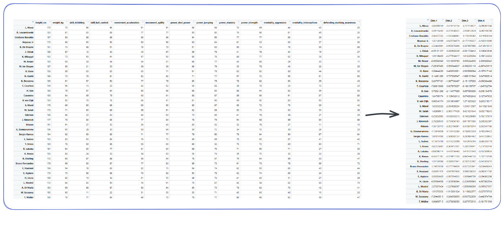

```{r setup, include=FALSE}
knitr::opts_chunk$set(echo = TRUE, comment = NA, tidy = TRUE, fig.height=6, fig.width=8)
```

# Introduction 

Dans ce travail, je me propose de vous exposer une méthode d'analyse de données très populaire appelée l'analyse en composantes principales (ACP). Après une brève description de cette méthode pour que vous sachiez à quoi elle sert je ferai une application sur un jeu de données qui contient des précieuses données sur les caractéristiques physiques des joueurs de football. 
Après avoir analysé le jeu de données avec l'ACP je ferai une classification ascendante hiérarchique en vue de regrouper les joueurs dans des groupes homogènes.
J'utiliserai le langage R avec les packages FactoMineR et factoextra pour réaliser l'étude. 

## L'ACP c'est quoi ?

L'analyse en composantes principales est une méthode mathématique et statistique pour décrire et factoriser un jeu de données multidimensionnelles. Par jeu de données multidimensionnelle j'entends un tableau de données dont les lignes sont des individus sont des unités statistiques (personnes, pays, départements ...) et dont les colonnes sont des caractéristiques observables de ces individus : age, poids, taille, salaire pour une personne par exemple, PIB (en euro), nombre d'habitants, budget défense pour un pays par exemple. Il est important que les données soient multidimensionnelles pour réaliser une ACP. Si le jeu de données contient par exmple 100 individus et deux colonnes alors il est plus intéressant d'utiliser des méthodes de statistiques bivariées pour étudier simultanément la distribution des colonnes (nuage de points, coefficients de corrélation). 

L'ACP fait partie de ce qu'on appelle les méthodes d'analyse factorielle. L'ACP est utilisée lorsque les variables que nous souhaitons étudier sont *toutes* quantitatives. 
La désignation **analyse factorielle** donne un indice sur ce que fait l'ACP. En effet lorsque nous factorisons une expression mathématiques (un polynome de 4e degré par exemple), en réalité nous simplifions son écriture afin de nous permettre analytiquement par exemple quels sont les racines du polynome et comment ces racines sont liées les une autres. 

Le Polynôme $P(x) = x^4 + x^3 - 7x^2 - 13x - 6$ peut être factorisé en cette expression plus simple $P(x) = (x + 1)(x + 1)(x - 3)(x + 2)$. Avec la forme factorisée de $P$ nous pouvons avec peu d'effort dire que $P(1)=0$ alors qu'il faudrait le calculer manuellement dans la forme non factorisée. 

L'ACP peut être vu comme une méthode mathématique et statistique qui nous permet de résumer un jeu de données multidimensionnelles en réduisant ses dimensions. 
Le graphique suivant illustre l'objectif de la méthode. Grâce à une ACP nous pouvons passer d'un jeu de données $(n * m)$ où $n$ représente le nombre de lignes (observations) et $m$ le nombre de colonnes (ou variables) à un nouveau jeu de données $(n * k)$ où $k << m$. Les nouvelles colonnes que l'ACP a créées sont appellées les composantes principales. 




## Présentation du jeu de données 

Le jeu de données sur lequel je vais réaliser une analyse en composantes principales vient du site *sofifa.com*. 


Sur ce site il est possible de récupérer des informations publiques sur les joueurs de football (age, salaire, valeur, taille, poids, rapidité ...). J'ai récupéré les données des joueurs pour l'année 2022. Le jeu de données que j'ai contient 19232 joueurs pour 74 colonnes (variables). 
Par souci de simplicité nous n'allons réaliser l'analyse en composantes principales que sur un échantillon du jeu de données. Je rends disponible le jeu de données afin de vous permettre de reproduire l'analyse si vous le souhaitez. Il vous suffit de référencer le lien https://raw.githubusercontent.com/agailloty/Outils-Analyses-R/main/dataset/fifa22.csv dans votre la fonction de lecture des données pour récupérer le jeu de données.

```{r}
fifa22 <- read.csv("https://raw.githubusercontent.com/agailloty/Outils-Analyses-R/main/dataset/fifa22.csv")
```


# Réaliser une ACP sur le jeu de données

La librairie standard de R contient une implémentation de l'analyse en composantes principales mais je préfère l'implémentation qui est faite dans le package FactoMineR. FactoMineR apporte des fonctionnalités supplémentaires pour aider à interpréter les résultats de l'ACP. 

Le jeu de données contient `r nrow(fifa22)` observations et `ncol(fifa22)` variables. Il serait plus pertinent de réaliser l'ACP sur un échantillon du jeu de données plutôt que sur tout le jeu de données. Je vais donc réaliser l'ACP sur un échantillon de 300 joueurs. Cet échantillon n'est pas aléatoire, il s'agit des 300 premiers joueurs classés selon la variable `overall` qui mesure la compétence globale du joueur sur une échelle de 0 à 100. 

```{r}
fifa300 <- fifa22[1:300,]
```

## Choix des variables actives et des variables illustratives

Une ACP ne se réalise que sur des données quantitatives. Il est possible de réaliser une ACP à partir d'un jeu de données ne contenant que des modalités discrètes, mais il faudrait trouver un moyen représenter les modalités discrètes en données numériques. Nous n'avons pas besoin de le faire dans cette étude car notre jeu de données contient essentiellement des données quantitatives continues qui mesurent les performances des joueurs sur une echelle de 0 à 100. 

Il existe un grand nombre de variables dans le jeu de données initial, je ne vais pas toutes les utiliser. Je vais réaliser le jeu de données en prenant comme variables actives les variable ssuivantes. Les variables actives sont les variables qui vont servir effectivement à construire les composantes. Autrement dit, une composante est une combinaison linéaire des variables actives. Selon la composante une variable active a une contribution plus ou moins forte. 

```{r}
var_actives <- c("age", "height_cm", "weight_kg", "shooting", "passing", "dribbling", 
"defending", "physic", "attacking_crossing", "attacking_finishing", 
"attacking_heading_accuracy", "attacking_short_passing", "attacking_volleys", 
"skill_dribbling", "skill_curve", "skill_fk_accuracy", "skill_long_passing", 
"skill_ball_control", "movement_acceleration", "movement_sprint_speed", 
"movement_agility", "movement_reactions", "movement_balance", 
"power_shot_power", "power_jumping", "power_stamina", "power_strength", 
"power_long_shots", "mentality_aggression", "mentality_interceptions", 
"mentality_positioning", "mentality_vision", "mentality_penalties", 
"mentality_composure", "defending_marking_awareness", "defending_standing_tackle", 
"defending_sliding_tackle", "goalkeeping_diving", "goalkeeping_handling", 
"goalkeeping_reflexes", "goalkeeping_speed")
```

Dans l'ACP il nous est aussi possible d'inclure ce qu'on appelle des variables illustratives. Ce sont des variables supplémentaires que nous décidons de ne pas inclure dans la composition des composantes mais qui vont nous servir par exemple d'interpréter les composantes. Dans les variables quantitatives illustratives j'ai choisi d'inclure la variable `overall` qui mesure par exemple la compétence globale du joueur sur une échelle de 0 à 100. Je sais que cette variable est en fait un aggrégé des plusieurs des variables actives, donc il serait redondant d'inclure encore la variable overall parmi les variables qui entrent dans la composition des composantes.  

Je choisis aussi de mettre les variables `value_eur`, `wage_eur` qui représentent respectivement la valeur estimée du joueur et son salaire en euro comme des variables illustratives car je ne veux m'intéresser qu'aux caractéristiques physiques des joueurs dans cette étude mais ces variables me permettent par exemple d'interpréter le degré de liaison entre le salaire et certaines des variables actives. Je pourrai voir dans quel sens évolue le salaire par rapport aux autres variables. 

Les variables qualitatives illustratives servent le même but que les variables quantitatives illustratives, à la différence qu'elles sont des modalités discrètes. 

J'inclus la variable `short_name` car elle va servir des noms des lignes dans le jeu de données. 

```{r}
var_quanti_illustratives <- c("overall", "potential", "value_eur", "wage_eur","league_level", "international_reputation")

var_quali_illustratives <- c("preferred_foot", "body_type")

fifa300 <- fifa300[, c(var_actives, var_quanti_illustratives, var_quali_illustratives, "short_name")]
rownames(fifa300) <- fifa300$short_name
fifa300 <- dplyr::select(fifa300, -short_name)
```


## Réalisation de l'ACP avec FactoMineR

Pour réaliser une ACP avec FactoMineR, il fournir à la fonction PCA les arguments suivants : 

- X : le jeu de données
- scale.unit : TRUE ou FALSE (pour réduire et centrer les données numériques)
- ncp : Le nombre de composantes principales
- quanti.sup : Les indices des variables quantitatives illustratives
- quali.sup : Les indices des variables qualitatives illustratives
- ind.sup : Les indices des lignes contenant les individus illustratifs. 
- graph : TRUE ou FALSE pour indiquer si R doit afficher les graphiques de l'ACP

Nous ne sommes pas obligés de renseigner tous les paramètres de la fonction PCA. 

La condition minimale à satisfaire pour réaliser une ACP avec la fonction PCA c'est de fournir en argument au paramètre X un jeu de données ne contenant que des variables numériques et ne contenant aucune donnée manquante. 

Dans ce cas une ACP sera réalisée en considérant toutes les colonnes comme variables actives. 

Dans la pratique nous voulons avoir un contrôle sur les résultats de l'ACP donc nous allons donner plus de précisions à la fonction PCA. 

Dans notre présent cas nous allons préciser les positions des variables actives, variables quantitatives illustratives et des variables qualitatives illustratives. 


```{r}
idx_var_actives <- match(var_actives, colnames(fifa300))
idx_var_quanti_illustratives <- match(var_quanti_illustratives, colnames(fifa300))
idx_var_quali_illustratives <- match(var_quali_illustratives, colnames(fifa300))
```

Puis nous chargeons les packages `FactoMineR` et `factoextra` pour calculer les composantes principales et produire des belles visualisations des résultats. 

```{r message=FALSE, warning=FALSE}
# Charger la librairie FactoMineR
library(FactoMineR)
library(factoextra) # Pour représenter graphiques
```

Nous calculons les résultats de l'ACP puis nous les enregistrons dans un objet qu'on nomme **premiere_acp**. Vous êtes libres d'appeler cet objet par le nom que vous voulez, il faut juste respecter les règles de nommages de variables dans R.

```{r message=FALSE, warning=FALSE}
premiere_acp <- PCA(X = fifa300, scale.unit = TRUE, quanti.sup = idx_var_quanti_illustratives, 
                    quali.sup = idx_var_quali_illustratives, graph = FALSE)
```

Les composantes viennent d'être calculées, il nous faut maintenant déterminer avec confiance le nombre de composantes à retenir. Chaque composante explique un pourcentage de l'inertie totale du jeu de données initial. 
Il existe autant de composantes que de variables actives dans une analyse en composantes principales. A la différence des variables actives, le pourcentage d'information contenue dans chaque composante décroit au fur et à mesure. La composante 1 explique nécessairement un pourcentage plus élevé de l'information que la composante 2 et ainsi de suite. 

$$C1 > C2 > C3 > Cn > Cn+1 $$

Il nous faut donc une règle pour déterminer combien de composantes nous retenons dans le pourcentage cumulé explique suffisamment l'information contenue dans le jeu de données initial. Nous voulons retenir le moins de composantes possibles qui explique un pourcentage satisfaisant de la variance totale du jeu de données. 

```{r include=FALSE}
ncp_tokeep <- sum(premiere_acp$eig[, 1] >=1)
```


Une règle nous permet de décider le nombre de compoantes à retenir, c'est la règle de Kaiser-Guttman. La règle de Kaiser-Guttman stipule **"Le nombre des valeurs-propres supérieures à l'unité d'une matrice d'inter-corrélation est égal au nombre de facteur à extraire"**. La valeur de la matrice d'inter-corrélation est ce que FactoMineR appelle eigenvalue. Dans le tableau suivant, si nous suivons la règle de Kaiser alors il nous faut retenir `r ncp_tokeep` composantes.


```{r}
head(premiere_acp$eig, 10)
```


Dans ce tableau nous lisons que `r ncp_tokeep` ont des valeurs propres (eigenvalue) supérieurs à 1. En suivant la règle de Kaiser il nous faudrait considérer toutes ces composantes dans l'analyse. 
Or nous voyons que le pouvoir explicatif marginal des composantes est négatif (chaque nouvelle composante explique de moins en moins l'inertie du jeu de données). Pour être efficient nous pouvons choisir de ne retenir que 4 composantes. Les 4 composantes nous permettront d'expliquer `r round(premiere_acp$eig[4, 3])`% de l'inertie totale. Ce pourcentage est très suffisant au vu du nombre de variables actives comprises dans l'ACP. En efet, nous somme passés de `r length(var_actives)` à 4 composantes tout en retenant `r round(premiere_acp$eig[4, 3])`% de l'information.

Le graphique suivant affiche le pourcentage de l'information expliquée par chaque composante.

```{r}
fviz_screeplot(premiere_acp, main = "% de l'information expliquée par chaque composante.")
```

Il importe maintenant d'explorer le contenu de chacune des 4 composantes que nous avons retenues pour expliquer la variabilité des individus. 

## Description des composantes

Une composante (ou dimension) est une variable synthétique formée comme une combinaison linéaire des variables initiales contenues dans le jeu de données. 

### Composante 1

Nous utilisons la fonction `dimdesc()` pour afficher des informations permettant de décrire une dimension. 
Le tableau suivant contient deux colonnes : la colonne correlation et p.value. La colonne correlation affiche le coefficient de corrélation entre chacune des variables actives et la composante considérée. 

La première composante est fortement corrélée positivement avec des variables comme ***`r names(sort(premiere_acp$var$cor[, 1], decreasing = TRUE))[1:5]`***  mais corrélée négativement avec les variables ***`r names(sort(premiere_acp$var$cor[, 1], decreasing = FALSE))[1:5]`***. 
Cette composante oppose donc des joueurs ayant un profil d'attaquant aux joueurs ayant un profil de gardien. 

```{r}
dimdesc(premiere_acp, axes = 1)
```

La première composante oppose donc des joueurs comme ***`r names(sort(premiere_acp$ind$coord[, 1], decreasing = TRUE))[1:10]`*** à des joueurs comme ***`r names(sort(premiere_acp$ind$coord[, 1], decreasing = FALSE))[1:10]`***. 

### Composante 2 

La deuxième composante est fortement corrélée positivement avec des variables comme ***`r names(sort(premiere_acp$var$cor[, 2], decreasing = TRUE))[1:5]`***  mais corrélée négativement avec les variables ***`r names(sort(premiere_acp$var$cor[, 2], decreasing = FALSE))[1:5]`***. 

```{r}
dimdesc(premiere_acp, axes = 2)
```

Cette composante oppose donc des joueurs comme ***`r names(sort(premiere_acp$ind$coord[, 2], decreasing = TRUE))[1:10]`*** à des joueurs comme ***`r names(sort(premiere_acp$ind$coord[, 2], decreasing = FALSE))[1:10]`***. 

### Représentation simultanée des axes 1 et 2

#### Le cercle des corrélations.

Les variables sont projetées dans un cercle de rayon 1 appelé cercle des corrélations. Le cercle permet de voir la corrélation ou la liaison entre les variables. 

```{r}
fviz_pca_var(premiere_acp, title = "Premier plan factoriel", repel = TRUE)
```


### Composante 3

La troisième composante est fortement corrélée positivement avec des variables comme ***`r names(sort(premiere_acp$var$cor[, 3], decreasing = TRUE))[1:5]`***  mais corrélée négativement avec les variables ***`r names(sort(premiere_acp$var$cor[, 3], decreasing = FALSE))[1:5]`***. 

```{r}
dimdesc(premiere_acp, axes = 3)
```

Cette composante oppose donc des joueurs comme ***`r names(sort(premiere_acp$ind$coord[, 3], decreasing = TRUE))[1:10]`*** à des joueurs comme ***`r names(sort(premiere_acp$ind$coord[, 3], decreasing = FALSE))[1:10]`***.


# Classification ascendate hiérarchique (CAH)

## Catégroriser les joueurs en groupes homogènes

On a un jeu de données de 100 joueurs, comment peut-on classer les joueurs en 5 groupes homogènes ?
On utilise la fonction HCPC du package FactoMineR, en précisant en argument l'objet acp qu'on a créé avec la fonction PCA, puis on précise le nombre de clusters (groupes, classes) qu'on veut produire. 
L'argument graph = FALSE instruit R de ne représenter les résultats graphiquement.

```{r}
classif <- HCPC(premiere_acp, nb.clust = 4, graph = FALSE)
```

## Description de chaque cluster

### Cluster 1

On peut utiliser une propriété de l'objet classif pour afficher la description de chaque cluster. 

```{r}
classif$desc.var$quanti$`1`
```

```{r}
rownames(fifa300)[classif$data.clust$clust == 1]
```

### Cluster 2 

```{r}
classif$desc.var$quanti$`2`
```

```{r}
rownames(fifa300)[classif$data.clust$clust == 2]
```

### Cluster 3

```{r}
classif$desc.var$quanti$`3`
```

```{r}
rownames(fifa300)[classif$data.clust$clust == 3]
```


## Les individus parangon 

Le but de la classification ascendante hiérarchique c'est de regrouper les individus qui se ressemblent le plus (minimiser la variance intra cluster) et faire en sorte que chaque cluster diffère d'un autre (maximiser la variance entre chaque cluster).

Les individus parangon sont les individus qui se rapprochent le plus du centre de chaque cluster. Ce sont les individus "moyens" de chaque cluster. C'est eux qui caractérisent le mieux le cluster étudié.

```{r}
classif$desc.ind$para
```


## Les individus spécifiques

Ce sont les individus les plus éloignés du centre du cluster. On aurait pu les mettre dans un autre cluster. Ils peuvent être à la frontière d'un ou plusieurs clusters.

```{r}
classif$desc.ind$dist
```

```{r}
factoextra::fviz_cluster(classif, repel = TRUE, title = "Représentation des clusters")
```

Nous pouvons réaliser une seconde classification mais cette fois-ci en laissant FactoMineR déterminer le nombre optimal de cluster. Pour ce faire nous pouvons indiquer dans la fonction `HCPC` le paramètre `nb.clust = -1`. 


```{r}
classif2 <- HCPC(premiere_acp, nb.clust = -1, graph = FALSE)
```

Représentons graphiquement les clusters. 

```{r}
fviz_cluster(classif2)
```

# Annexes 

## Le jeu de données

Voici comment est composé le jeu de données initial. 

```{r}
str(fifa22)
```


## Résumé des résultats 

```{r}
summary(premiere_acp)
```


# Bibliographie

Kassambara A, Mundt F (2020). _factoextra: Extract and Visualize the Results of Multivariate Data Analyses_. R
  package version 1.0.7, <https://CRAN.R-project.org/package=factoextra>.

JJ Allaire and Yihui Xie and Jonathan McPherson and Javier Luraschi and Kevin Ushey and Aron Atkins and Hadley
  Wickham and Joe Cheng and Winston Chang and Richard Iannone (2023). rmarkdown: Dynamic Documents for R. R package
  version 2.20. URL https://rmarkdown.rstudio.com.

  Yihui Xie and J.J. Allaire and Garrett Grolemund (2018). R Markdown: The Definitive Guide. Chapman and Hall/CRC.
  ISBN 9781138359338. URL https://bookdown.org/yihui/rmarkdown.

  Yihui Xie and Christophe Dervieux and Emily Riederer (2020). R Markdown Cookbook. Chapman and Hall/CRC. ISBN
  9780367563837. URL https://bookdown.org/yihui/rmarkdown-cookbook.
  
  Xie Y (2016). _bookdown: Authoring Books and Technical Documents with R Markdown_. Chapman and Hall/CRC, Boca
  Raton, Florida. ISBN 978-1138700109, <https://bookdown.org/yihui/bookdown>.

Sebastien Le, Julie Josse, Francois Husson (2008). FactoMineR: An R Package for Multivariate Analysis. Journal of
  Statistical Software, 25(1), 1-18. 10.18637/jss.v025.i01
  
  Wickham H, François R, Henry L, Müller K, Vaughan D (2023). _dplyr: A Grammar of Data Manipulation_. R package
  version 1.1.0, <https://CRAN.R-project.org/package=dplyr>.
