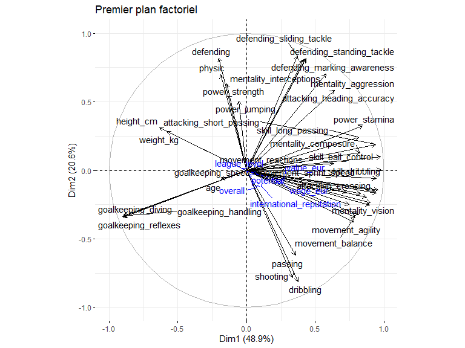
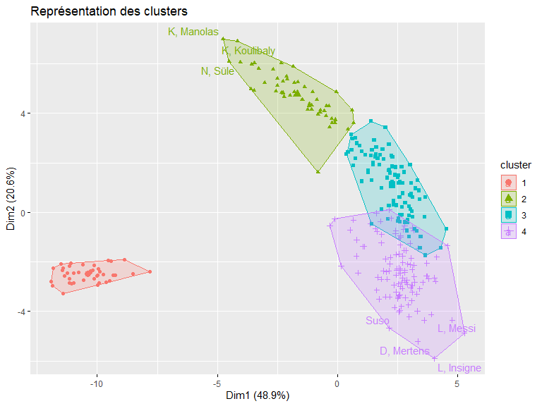
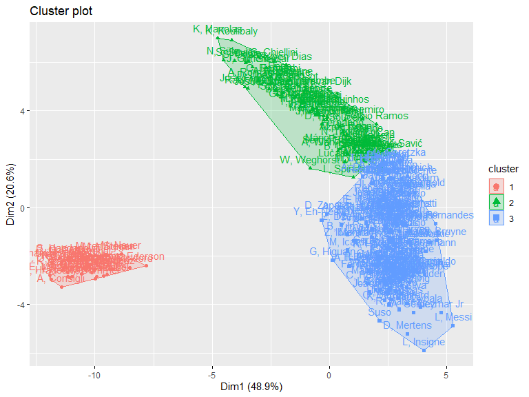

# Introduction

Dans ce travail, je me propose de vous exposer une méthode d’analyse de
données très populaire appelée l’analyse en composantes principales
(ACP). Après une brève description de cette méthode pour que vous
sachiez à quoi elle sert je ferai une application sur un jeu de données
qui contient des précieuses données sur les caractéristiques physiques
des joueurs de football. Après avoir analysé le jeu de données avec
l’ACP je ferai une classification ascendante hiérarchique en vue de
regrouper les joueurs dans des groupes homogènes. J’utiliserai le
langage R avec les packages FactoMineR et factoextra pour réaliser
l’étude.

## L’ACP c’est quoi ?

L’analyse en composantes principales est une méthode mathématique et
statistique pour décrire et factoriser un jeu de données
multidimensionnelles. Par jeu de données multidimensionnelle j’entends
un tableau de données dont les lignes sont des individus sont des unités
statistiques (personnes, pays, départements …) et dont les colonnes sont
des caractéristiques observables de ces individus : age, poids, taille,
salaire pour une personne par exemple, PIB (en euro), nombre
d’habitants, budget défense pour un pays par exemple. Il est important
que les données soient multidimensionnelles pour réaliser une ACP. Si le
jeu de données contient par exmple 100 individus et deux colonnes alors
il est plus intéressant d’utiliser des méthodes de statistiques
bivariées pour étudier simultanément la distribution des colonnes (nuage
de points, coefficients de corrélation).

L’ACP fait partie de ce qu’on appelle les méthodes d’analyse
factorielle. L’ACP est utilisée lorsque les variables que nous
souhaitons étudier sont *toutes* quantitatives. La désignation **analyse
factorielle** donne un indice sur ce que fait l’ACP. En effet lorsque
nous factorisons une expression mathématiques (un polynome de 4e degré
par exemple), en réalité nous simplifions son écriture afin de nous
permettre analytiquement par exemple quels sont les racines du polynome
et comment ces racines sont liées les une autres.

Le Polynôme
*P*(*x*) = *x*4 + *x*3 − 7*x*2 − 13*x* − 6
peut être factorisé en cette expression plus simple
*P*(*x*) = (*x*+1)(*x*+1)(*x*−3)(*x*+2). Avec la forme factorisée de *P*
nous pouvons avec peu d’effort dire que *P*(1) = 0 alors qu’il faudrait
le calculer manuellement dans la forme non factorisée.

L’ACP peut être vu comme une méthode mathématique et statistique qui
nous permet de résumer un jeu de données multidimensionnelles en
réduisant ses dimensions. Le graphique suivant illustre l’objectif de la
méthode. Grâce à une ACP nous pouvons passer d’un jeu de données
(*n*\**m*) où *n* représente le nombre de lignes (observations) et *m*
le nombre de colonnes (ou variables) à un nouveau jeu de données
(*n*\**k*) où *k* &lt;  &lt; *m*. Les nouvelles colonnes que l’ACP a
créées sont appellées les composantes principales.

## Présentation du jeu de données

Le jeu de données sur lequel je vais réaliser une analyse en composantes
principales vient du site *sofifa.com*.

Sur ce site il est possible de récupérer des informations publiques sur
les joueurs de football (age, salaire, valeur, taille, poids, rapidité
…). J’ai récupéré les données des joueurs pour l’année 2022. Le jeu de
données que j’ai contient 19232 joueurs pour 74 colonnes (variables).
Par souci de simplicité nous n’allons réaliser l’analyse en composantes
principales que sur un échantillon du jeu de données. Je rends
disponible le jeu de données afin de vous permettre de reproduire
l’analyse si vous le souhaitez. Il vous suffit de référencer le lien
<https://raw.githubusercontent.com/agailloty/Outils-Analyses-R/main/dataset/fifa22.csv>
dans votre la fonction de lecture des données pour récupérer le jeu de
données.

    fifa22 <- read.csv("https://raw.githubusercontent.com/agailloty/Outils-Analyses-R/main/dataset/fifa22.csv")

# Réaliser une ACP sur le jeu de données

La librairie standard de R contient une implémentation de l’analyse en
composantes principales mais je préfère l’implémentation qui est faite
dans le package FactoMineR. FactoMineR apporte des fonctionnalités
supplémentaires pour aider à interpréter les résultats de l’ACP.

Le jeu de données contient 19239 observations et `ncol(fifa22)`
variables. Il serait plus pertinent de réaliser l’ACP sur un échantillon
du jeu de données plutôt que sur tout le jeu de données. Je vais donc
réaliser l’ACP sur un échantillon de 300 joueurs. Cet échantillon n’est
pas aléatoire, il s’agit des 300 premiers joueurs classés selon la
variable `overall` qui mesure la compétence globale du joueur sur une
échelle de 0 à 100.

    fifa300 <- fifa22[1:300,]

## Choix des variables actives et des variables illustratives

Une ACP ne se réalise que sur des données quantitatives. Il est possible
de réaliser une ACP à partir d’un jeu de données ne contenant que des
modalités discrètes, mais il faudrait trouver un moyen représenter les
modalités discrètes en données numériques. Nous n’avons pas besoin de le
faire dans cette étude car notre jeu de données contient essentiellement
des données quantitatives continues qui mesurent les performances des
joueurs sur une echelle de 0 à 100.

Il existe un grand nombre de variables dans le jeu de données initial,
je ne vais pas toutes les utiliser. Je vais réaliser le jeu de données
en prenant comme variables actives les variable ssuivantes. Les
variables actives sont les variables qui vont servir effectivement à
construire les composantes. Autrement dit, une composante est une
combinaison linéaire des variables actives. Selon la composante une
variable active a une contribution plus ou moins forte.

    var_actives <- c("age", "height_cm", "weight_kg", "shooting", "passing", "dribbling", 
    "defending", "physic", "attacking_crossing", "attacking_finishing", 
    "attacking_heading_accuracy", "attacking_short_passing", "attacking_volleys", 
    "skill_dribbling", "skill_curve", "skill_fk_accuracy", "skill_long_passing", 
    "skill_ball_control", "movement_acceleration", "movement_sprint_speed", 
    "movement_agility", "movement_reactions", "movement_balance", 
    "power_shot_power", "power_jumping", "power_stamina", "power_strength", 
    "power_long_shots", "mentality_aggression", "mentality_interceptions", 
    "mentality_positioning", "mentality_vision", "mentality_penalties", 
    "mentality_composure", "defending_marking_awareness", "defending_standing_tackle", 
    "defending_sliding_tackle", "goalkeeping_diving", "goalkeeping_handling", 
    "goalkeeping_reflexes", "goalkeeping_speed")

Dans l’ACP il nous est aussi possible d’inclure ce qu’on appelle des
variables illustratives. Ce sont des variables supplémentaires que nous
décidons de ne pas inclure dans la composition des composantes mais qui
vont nous servir par exemple d’interpréter les composantes. Dans les
variables quantitatives illustratives j’ai choisi d’inclure la variable
`overall` qui mesure par exemple la compétence globale du joueur sur une
échelle de 0 à 100. Je sais que cette variable est en fait un aggrégé
des plusieurs des variables actives, donc il serait redondant d’inclure
encore la variable overall parmi les variables qui entrent dans la
composition des composantes.

Je choisis aussi de mettre les variables `value_eur`, `wage_eur` qui
représentent respectivement la valeur estimée du joueur et son salaire
en euro comme des variables illustratives car je ne veux m’intéresser
qu’aux caractéristiques physiques des joueurs dans cette étude mais ces
variables me permettent par exemple d’interpréter le degré de liaison
entre le salaire et certaines des variables actives. Je pourrai voir
dans quel sens évolue le salaire par rapport aux autres variables.

Les variables qualitatives illustratives servent le même but que les
variables quantitatives illustratives, à la différence qu’elles sont des
modalités discrètes.

J’inclus la variable `short_name` car elle va servir des noms des lignes
dans le jeu de données.

    var_quanti_illustratives <- c("overall", "potential", "value_eur", "wage_eur","league_level", "international_reputation")

    var_quali_illustratives <- c("preferred_foot", "body_type")

    fifa300 <- fifa300[, c(var_actives, var_quanti_illustratives, var_quali_illustratives, "short_name")]
    rownames(fifa300) <- fifa300$short_name
    fifa300 <- dplyr::select(fifa300, -short_name)

## Réalisation de l’ACP avec FactoMineR

Pour réaliser une ACP avec FactoMineR, il fournir à la fonction PCA les
arguments suivants :

-   X : le jeu de données
-   scale.unit : TRUE ou FALSE (pour réduire et centrer les données
    numériques)
-   ncp : Le nombre de composantes principales
-   quanti.sup : Les indices des variables quantitatives illustratives
-   quali.sup : Les indices des variables qualitatives illustratives
-   ind.sup : Les indices des lignes contenant les individus
    illustratifs.
-   graph : TRUE ou FALSE pour indiquer si R doit afficher les
    graphiques de l’ACP

Nous ne sommes pas obligés de renseigner tous les paramètres de la
fonction PCA.

La condition minimale à satisfaire pour réaliser une ACP avec la
fonction PCA c’est de fournir en argument au paramètre X un jeu de
données ne contenant que des variables numériques et ne contenant aucune
donnée manquante.

Dans ce cas une ACP sera réalisée en considérant toutes les colonnes
comme variables actives.

Dans la pratique nous voulons avoir un contrôle sur les résultats de
l’ACP donc nous allons donner plus de précisions à la fonction PCA.

Dans notre présent cas nous allons préciser les positions des variables
actives, variables quantitatives illustratives et des variables
qualitatives illustratives.

    idx_var_actives <- match(var_actives, colnames(fifa300))
    idx_var_quanti_illustratives <- match(var_quanti_illustratives, colnames(fifa300))
    idx_var_quali_illustratives <- match(var_quali_illustratives, colnames(fifa300))

Puis nous chargeons les packages `FactoMineR` et `factoextra` pour
calculer les composantes principales et produire des belles
visualisations des résultats.

    # Charger la librairie FactoMineR
    library(FactoMineR)
    library(factoextra) # Pour représenter graphiques

Nous calculons les résultats de l’ACP puis nous les enregistrons dans un
objet qu’on nomme **premiere\_acp**. Vous êtes libres d’appeler cet
objet par le nom que vous voulez, il faut juste respecter les règles de
nommages de variables dans R.

    premiere_acp <- PCA(X = fifa300, scale.unit = TRUE, quanti.sup = idx_var_quanti_illustratives, 
                        quali.sup = idx_var_quali_illustratives, graph = FALSE)

Les composantes viennent d’être calculées, il nous faut maintenant
déterminer avec confiance le nombre de composantes à retenir. Chaque
composante explique un pourcentage de l’inertie totale du jeu de données
initial. Il existe autant de composantes que de variables actives dans
une analyse en composantes principales. A la différence des variables
actives, le pourcentage d’information contenue dans chaque composante
décroit au fur et à mesure. La composante 1 explique nécessairement un
pourcentage plus élevé de l’information que la composante 2 et ainsi de
suite.

*C*1 &gt; *C*2 &gt; *C*3 &gt; *C**n* &gt; *C**n* + 1

Il nous faut donc une règle pour déterminer combien de composantes nous
retenons dans le pourcentage cumulé explique suffisamment l’information
contenue dans le jeu de données initial. Nous voulons retenir le moins
de composantes possibles qui explique un pourcentage satisfaisant de la
variance totale du jeu de données.

Une règle nous permet de décider le nombre de compoantes à retenir,
c’est la règle de Kaiser-Guttman. La règle de Kaiser-Guttman stipule
**“Le nombre des valeurs-propres supérieures à l’unité d’une matrice
d’inter-corrélation est égal au nombre de facteur à extraire”**. La
valeur de la matrice d’inter-corrélation est ce que FactoMineR appelle
eigenvalue. Dans le tableau suivant, si nous suivons la règle de Kaiser
alors il nous faut retenir 6 composantes.

    head(premiere_acp$eig, 10)

            eigenvalue percentage of variance cumulative percentage of variance
    comp 1  20.0572937             48.9202285                          48.92023
    comp 2   8.4412037             20.5883017                          69.50853
    comp 3   2.8928336              7.0556917                          76.56422
    comp 4   1.9897111              4.8529539                          81.41718
    comp 5   1.3313413              3.2471739                          84.66435
    comp 6   1.1008137              2.6849114                          87.34926
    comp 7   0.9805991              2.3917051                          89.74097
    comp 8   0.7029103              1.7144153                          91.45538
    comp 9   0.4736325              1.1552013                          92.61058
    comp 10  0.4094412              0.9986372                          93.60922

Dans ce tableau nous lisons que 6 ont des valeurs propres (eigenvalue)
supérieurs à 1. En suivant la règle de Kaiser il nous faudrait
considérer toutes ces composantes dans l’analyse. Or nous voyons que le
pouvoir explicatif marginal des composantes est négatif (chaque nouvelle
composante explique de moins en moins l’inertie du jeu de données). Pour
être efficient nous pouvons choisir de ne retenir que 4 composantes. Les
4 composantes nous permettront d’expliquer 81% de l’inertie totale. Ce
pourcentage est très suffisant au vu du nombre de variables actives
comprises dans l’ACP. En efet, nous somme passés de 41 à 4 composantes
tout en retenant 81% de l’information.

Le graphique suivant affiche le pourcentage de l’information expliquée
par chaque composante.

    fviz_screeplot(premiere_acp, main = "% de l'information expliquée par chaque composante.")

Il importe maintenant d’explorer le contenu de chacune des 4 composantes
que nous avons retenues pour expliquer la variabilité des individus.

## Description des composantes

Une composante (ou dimension) est une variable synthétique formée comme
une combinaison linéaire des variables initiales contenues dans le jeu
de données.

### Composante 1

Nous utilisons la fonction `dimdesc()` pour afficher des informations
permettant de décrire une dimension. Le tableau suivant contient deux
colonnes : la colonne correlation et p.value. La colonne correlation
affiche le coefficient de corrélation entre chacune des variables
actives et la composante considérée.

La première composante est fortement corrélée positivement avec des
variables comme ***skill\_dribbling, skill\_ball\_control, skill\_curve,
attacking\_crossing, mentality\_positioning*** mais corrélée
négativement avec les variables ***goalkeeping\_handling,
goalkeeping\_diving, goalkeeping\_reflexes, height\_cm, weight\_kg***.
Cette composante oppose donc des joueurs ayant un profil d’attaquant aux
joueurs ayant un profil de gardien.

    dimdesc(premiere_acp, axes = 1)

    $Dim.1

    Link between the variable and the continuous variables (R-square)
    =================================================================================
                                correlation       p.value
    <NA>                                 NA            NA
    skill_dribbling               0.9776008 9.626627e-204
    skill_ball_control            0.9734827 5.910217e-193
    skill_curve                   0.9580603 8.633448e-164
    attacking_crossing            0.9449585 1.257009e-146
    mentality_positioning         0.9432174 1.141386e-144
    attacking_short_passing       0.9391900 2.287080e-140
    power_long_shots              0.9319331 2.600929e-133
    attacking_finishing           0.9011034 3.658002e-110
    attacking_volleys             0.8947263 2.468784e-106
    skill_fk_accuracy             0.8737699  2.695411e-95
    power_stamina                 0.8446752  7.147275e-83
    mentality_penalties           0.8294278  2.422910e-77
    mentality_composure           0.8255691  4.980486e-76
    skill_long_passing            0.8156497  8.490976e-73
    mentality_vision              0.8141915  2.440967e-72
    movement_balance              0.7901239  2.617927e-65
    movement_agility              0.7822659  3.282081e-63
    power_shot_power              0.7476363  6.559311e-55
    movement_acceleration         0.7288051  6.076953e-51
    attacking_heading_accuracy    0.6381435  1.041886e-35
    movement_sprint_speed         0.6340040  3.916846e-35
    mentality_aggression          0.5773816  4.560886e-28
    defending_standing_tackle     0.4333348  3.656330e-15
    defending_marking_awareness   0.4268507  1.028537e-14
    mentality_interceptions       0.4134924  8.086224e-14
    dribbling                     0.3759997  1.650293e-11
    defending_sliding_tackle      0.3722649  2.703824e-11
    passing                       0.3560642  2.141816e-10
    shooting                      0.3353111  2.571518e-09
    movement_reactions            0.2872431  4.159912e-07
    value_eur                     0.2756943  1.237493e-06
    wage_eur                      0.2637547  3.629100e-06
    power_strength               -0.1441510  1.243992e-02
    age                          -0.1854346  1.253403e-03
    physic                       -0.1903499  9.212295e-04
    defending                    -0.1998991  4.956074e-04
    weight_kg                    -0.5798251  2.410912e-28
    height_cm                    -0.6327500  5.826904e-35
    goalkeeping_reflexes         -0.8977048 4.320073e-108
    goalkeeping_diving           -0.8992596 4.973608e-109
    goalkeeping_handling         -0.9029769 2.445962e-111

    Link between the variable and the categorical variable (1-way anova)
    =============================================
                     R2      p.value
    body_type 0.2816409 1.577129e-17

    Link between variable abd the categories of the categorical variables
    ================================================================
                                 Estimate      p.value
    body_type=Lean (170-185)    2.0515519 4.465513e-04
    body_type=Normal (170-185)  1.4246581 8.205183e-04
    body_type=Unique            0.4751575 1.311043e-02
    body_type=Stocky (185+)    -4.1886448 6.286173e-03
    body_type=Lean (185+)      -3.1572534 4.307635e-04
    body_type=Normal (185+)    -4.1823260 3.436073e-12

La première composante oppose donc des joueurs comme ***L, Messi, Neymar
Jr, K, De Bruyne, Bruno Fernandes, L, Modrić, A, Griezmann, K, Mbappé,
L, Insigne, M, Salah, P, Dybala*** à des joueurs comme ***É, Mendy, L,
Hrádecký, Raphaelinho Anjos, P, Gulácsi, K, Trapp, A, Consigli, Unai
Simón, K, Casteels, O, Baumann, S, Sirigu***.

### Composante 2

La deuxième composante est fortement corrélée positivement avec des
variables comme ***defending\_sliding\_tackle, defending,
defending\_standing\_tackle, defending\_marking\_awareness,
mentality\_interceptions*** mais corrélée négativement avec les
variables ***dribbling, shooting, passing, movement\_agility,
movement\_balance***.

    dimdesc(premiere_acp, axes = 2)

    $Dim.2

    Link between the variable and the continuous variables (R-square)
    =================================================================================
                                correlation      p.value
    <NA>                                 NA           NA
    defending_sliding_tackle      0.8335318 8.938024e-79
    defending                     0.8181052 1.404119e-73
    defending_standing_tackle     0.8174672 2.246977e-73
    defending_marking_awareness   0.8135476 3.879769e-72
    mentality_interceptions       0.8072882 3.199592e-70
    mentality_aggression          0.7032348 4.627344e-46
    physic                        0.6973717 5.149550e-45
    power_strength                0.6327366 5.851669e-35
    attacking_heading_accuracy    0.5849485 6.223913e-29
    power_jumping                 0.5055627 7.182429e-21
    power_stamina                 0.3223438 1.109595e-08
    height_cm                     0.3111434 3.715245e-08
    weight_kg                     0.2826331 6.466117e-07
    skill_long_passing            0.2419487 2.272454e-05
    attacking_short_passing       0.1886372 1.026442e-03
    mentality_composure           0.1310983 2.314576e-02
    international_reputation     -0.1226144 3.376268e-02
    overall                      -0.1271726 2.763368e-02
    skill_curve                  -0.1451432 1.184259e-02
    power_long_shots             -0.1471418 1.071569e-02
    movement_acceleration        -0.1612404 5.119021e-03
    mentality_positioning        -0.1653057 4.091702e-03
    mentality_penalties          -0.1708475 2.990940e-03
    skill_fk_accuracy            -0.1957465 6.512629e-04
    attacking_finishing          -0.2374429 3.252352e-05
    power_shot_power             -0.2508276 1.098513e-05
    attacking_volleys            -0.2523536 9.668360e-06
    mentality_vision             -0.3232085 1.008661e-08
    goalkeeping_diving           -0.3342818 2.895211e-09
    goalkeeping_handling         -0.3348499 2.711973e-09
    goalkeeping_reflexes         -0.3402596 1.445321e-09
    movement_balance             -0.3417654 1.210439e-09
    movement_agility             -0.3763270 1.579923e-11
    passing                      -0.6203843 2.660060e-33
    shooting                     -0.7818227 4.284330e-63
    dribbling                    -0.8116638 1.489475e-71

    Link between the variable and the categorical variable (1-way anova)
    =============================================
                      R2      p.value
    body_type 0.09721904 0.0002058198

    Link between variable abd the categories of the categorical variables
    ================================================================
                              Estimate      p.value
    body_type=Normal (185+)  1.5274142 9.808896e-05
    body_type=Stocky (185+)  2.0893776 2.866877e-02
    body_type=Unique        -0.4192054 1.905668e-02

Cette composante oppose donc des joueurs comme ***K, Manolas, K,
Koulibaly, N, Süle, S, Savić, G, Chiellini, Felipe, S, Coates, Rúben
Dias, J, Giménez, M, Škriniar*** à des joueurs comme ***L, Insigne, D,
Mertens, L, Messi, Suso, A, Gómez, Neymar Jr, R, Mahrez, P, Dybala, K,
Coman, E, Hazard***.

### Représentation simultanée des axes 1 et 2

#### Le cercle des corrélations.

Les variables sont projetées dans un cercle de rayon 1 appelé cercle des
corrélations. Le cercle permet de voir la corrélation ou la liaison
entre les variables.

    fviz_pca_var(premiere_acp, title = "Premier plan factoriel", repel = TRUE)

    Warning: ggrepel: 9 unlabeled data points (too many overlaps). Consider increasing max.overlaps

### Composante 3

La troisième composante est fortement corrélée positivement avec des
variables comme ***power\_strength, weight\_kg, height\_cm, physic,
power\_shot\_power*** mais corrélée négativement avec les variables
***defending, defending\_sliding\_tackle, mentality\_interceptions,
defending\_marking\_awareness, defending\_standing\_tackle***.

    dimdesc(premiere_acp, axes = 3)

    $Dim.3

    Link between the variable and the continuous variables (R-square)
    =================================================================================
                                correlation      p.value
    <NA>                                 NA           NA
    power_strength                0.6293036 1.719727e-34
    weight_kg                     0.5467477 8.739980e-25
    height_cm                     0.4844630 4.625545e-19
    physic                        0.4537075 1.223796e-16
    power_shot_power              0.3720569 2.778702e-11
    attacking_heading_accuracy    0.3595689 1.382290e-10
    shooting                      0.3477592 5.919063e-10
    power_jumping                 0.3350651 2.645533e-09
    movement_reactions            0.3016492 9.956602e-08
    mentality_penalties           0.2918878 2.646044e-07
    attacking_finishing           0.2775920 1.038025e-06
    attacking_volleys             0.2463499 1.590345e-05
    international_reputation      0.2251645 8.343199e-05
    overall                       0.1989346 5.283242e-04
    mentality_positioning         0.1604030 5.357452e-03
    movement_sprint_speed         0.1579530 6.113386e-03
    power_long_shots              0.1544707 7.352372e-03
    wage_eur                      0.1447236 1.209207e-02
    age                           0.1357003 1.869926e-02
    mentality_composure           0.1334386 2.078183e-02
    value_eur                     0.1220487 3.459857e-02
    dribbling                    -0.1263035 2.872253e-02
    movement_agility             -0.1784384 1.917777e-03
    skill_long_passing           -0.1823641 1.513441e-03
    movement_balance             -0.2563018 6.922086e-06
    passing                      -0.2872395 4.161370e-07
    defending_standing_tackle    -0.2964675 1.680374e-07
    defending_marking_awareness  -0.3117650 3.478761e-08
    mentality_interceptions      -0.3226623 1.071327e-08
    defending_sliding_tackle     -0.3343619 2.868665e-09
    defending                    -0.4024909 4.130122e-13

    Link between the variable and the categorical variable (1-way anova)
    =============================================
                     R2      p.value
    body_type 0.1783925 1.280993e-09

    Link between variable abd the categories of the categorical variables
    ================================================================
                                 Estimate      p.value
    body_type=Unique            1.0426262 0.0001156591
    body_type=Normal (185+)     0.9674505 0.0437554730
    body_type=Lean (170-)      -2.7566505 0.0059263924
    body_type=Normal (170-185) -0.1088143 0.0018253871
    body_type=Normal (170-)    -1.6477304 0.0014287292
    body_type=Lean (170-185)   -0.4707397 0.0001382698

Cette composante oppose donc des joueurs comme ***R, Lukaku, E, Haaland,
Z, Ibrahimović, D, Zapata, W, Weghorst, Cristiano Ronaldo, R,
Lewandowski, H, Kane, B, Yılmaz, C, Immobile*** à des joueurs comme
***M, Verratti, Jesús Navas, R, Guerreiro, L, Insigne, J, Corona, Juan
Bernat, Gayà, P, Foden, Rafa, M, Ødegaard***.

# Classification ascendate hiérarchique (CAH)

## Catégroriser les joueurs en groupes homogènes

On a un jeu de données de 100 joueurs, comment peut-on classer les
joueurs en 5 groupes homogènes ? On utilise la fonction HCPC du package
FactoMineR, en précisant en argument l’objet acp qu’on a créé avec la
fonction PCA, puis on précise le nombre de clusters (groupes, classes)
qu’on veut produire. L’argument graph = FALSE instruit R de ne
représenter les résultats graphiquement.

    classif <- HCPC(premiere_acp, nb.clust = 4, graph = FALSE)

## Description de chaque cluster

### Cluster 1

On peut utiliser une propriété de l’objet classif pour afficher la
description de chaque cluster.

    classif$desc.var$quanti$`1`

                                    v.test Mean in category Overall mean sd in category   Overall sd
    goalkeeping_diving           17.143431      8.37500e+01 2.001000e+01   2.896118e+00 2.521699e+01
    goalkeeping_reflexes         17.140579      8.53250e+01 2.040000e+01   3.101512e+00 2.569008e+01
    goalkeeping_handling         17.137652      8.15750e+01 1.981333e+01   3.254900e+00 2.444255e+01
    height_cm                     7.561986      1.90675e+02 1.828333e+02   3.901202e+00 7.033175e+00
    weight_kg                     7.056380      8.54750e+01 7.759667e+01   4.790551e+00 7.572361e+00
    age                           3.189838      3.03750e+01 2.853000e+01   3.359222e+00 3.922894e+00
    wage_eur                     -2.592203      8.16500e+04 1.075753e+05   5.937910e+04 6.783173e+04
    value_eur                    -3.005434      3.32650e+07 4.577157e+07   3.036385e+07 2.822344e+07
    movement_reactions           -3.489408      8.10000e+01 8.301000e+01   3.687818e+00 3.906819e+00
    movement_agility             -9.823111      5.22250e+01 7.242667e+01   9.269540e+00 1.394816e+01
    defending_sliding_tackle     -9.949500      1.45250e+01 5.380333e+01   3.114382e+00 2.677508e+01
    movement_balance             -9.957564      4.56750e+01 6.933333e+01   8.716041e+00 1.611424e+01
    power_shot_power            -10.037201      5.83250e+01 7.487667e+01   4.383991e+00 1.118428e+01
    mentality_vision            -10.160249      5.37000e+01 7.336333e+01   1.018381e+01 1.312598e+01
    mentality_interceptions     -10.342853      2.07500e+01 5.860000e+01   4.720964e+00 2.482015e+01
    movement_sprint_speed       -10.600854      5.04500e+01 7.196333e+01   7.290233e+00 1.376403e+01
    movement_acceleration       -10.695645      4.98250e+01 7.190000e+01   7.179441e+00 1.399821e+01
    defending_standing_tackle   -10.871750      1.51250e+01 5.762333e+01   3.124000e+00 2.651254e+01
    defending_marking_awareness -10.961482      1.83000e+01 5.810000e+01   5.988322e+00 2.462593e+01
    mentality_penalties         -12.354041      2.40500e+01 6.044333e+01   9.259995e+00 1.997983e+01
    skill_fk_accuracy           -12.534844      1.44250e+01 5.720000e+01   3.129597e+00 2.314462e+01
    attacking_volleys           -13.008468      1.33250e+01 5.914667e+01   3.289282e+00 2.389041e+01
    mentality_aggression        -13.023258      3.21500e+01 6.767000e+01   7.428156e+00 1.849832e+01
    attacking_finishing         -13.267221      1.27750e+01 6.140667e+01   2.733930e+00 2.486097e+01
    skill_long_passing          -13.679517      3.94250e+01 7.065000e+01   1.186357e+01 1.548141e+01
    mentality_composure         -13.791917      6.19500e+01 7.928000e+01   7.148252e+00 8.522222e+00
    power_long_shots            -13.969603      1.43250e+01 6.336000e+01   3.423357e+00 2.380680e+01
    mentality_positioning       -14.076038      1.25000e+01 6.559000e+01   2.974895e+00 2.558063e+01
    skill_curve                 -14.250505      1.53000e+01 6.497333e+01   4.290688e+00 2.364133e+01
    attacking_heading_accuracy  -14.301447      1.47750e+01 6.224333e+01   4.782716e+00 2.251142e+01
    attacking_crossing          -14.383234      1.45250e+01 6.402667e+01   3.464011e+00 2.334222e+01
    power_stamina               -14.639414      3.82750e+01 7.339000e+01   5.108755e+00 1.626851e+01
    skill_dribbling             -15.877012      1.67250e+01 7.064667e+01   5.590114e+00 2.303422e+01
    attacking_short_passing     -15.936420      3.97000e+01 7.583333e+01   1.053613e+01 1.537787e+01
    skill_ball_control          -16.346452      2.66250e+01 7.467000e+01   7.999023e+00 1.993442e+01
                                     p.value
    goalkeeping_diving          7.037327e-66
    goalkeeping_reflexes        7.391108e-66
    goalkeeping_handling        7.772638e-66
    height_cm                   3.969623e-14
    weight_kg                   1.708965e-12
    age                         1.423524e-03
    wage_eur                    9.536351e-03
    value_eur                   2.652022e-03
    movement_reactions          4.840924e-04
    movement_agility            8.953669e-23
    defending_sliding_tackle    2.534528e-23
    movement_balance            2.337194e-23
    power_shot_power            1.046004e-23
    mentality_vision            2.983133e-24
    mentality_interceptions     4.509108e-25
    movement_sprint_speed       2.952711e-26
    movement_acceleration       1.066744e-26
    defending_standing_tackle   1.571564e-27
    defending_marking_awareness 5.853310e-28
    mentality_penalties         4.632464e-35
    skill_fk_accuracy           4.813099e-36
    attacking_volleys           1.095160e-38
    mentality_aggression        9.023739e-39
    attacking_finishing         3.586368e-40
    skill_long_passing          1.345845e-42
    mentality_composure         2.850819e-43
    power_long_shots            2.389544e-44
    mentality_positioning       5.331635e-45
    skill_curve                 4.450498e-46
    attacking_heading_accuracy  2.143079e-46
    attacking_crossing          6.593949e-47
    power_stamina               1.574195e-48
    skill_dribbling             9.143160e-57
    attacking_short_passing     3.540678e-57
    skill_ball_control          4.610540e-60

    rownames(fifa300)[classif$data.clust$clust == 1]

     [1] "J, Oblak"          "M, Neuer"          "M, ter Stegen"     "T, Courtois"      
     [5] "Ederson"           "Alisson"           "G, Donnarumma"     "K, Navas"         
     [9] "H, Lloris"         "W, Szczęsny"       "S, Handanovič"     "K, Casteels"      
    [13] "K, Schmeichel"     "Y, Sommer"         "P, Gulácsi"        "De Gea"           
    [17] "E, Martínez"       "M, Maignan"        "Sergio Asenjo"     "L, Hrádecký"      
    [21] "B, Leno"           "N, Pope"           "J, Pickford"       "É, Mendy"         
    [25] "Ł, Fabiański"      "S, Sirigu"         "Rui Patrício"      "K, Trapp"         
    [29] "A, Areola"         "O, Baumann"        "Neto"              "A, Lopes"         
    [33] "Y, Bounou"         "P, Gollini"        "Raphaelinho Anjos" "Unai Simón"       
    [37] "D, Livaković"      "A, Consigli"       "S, Mandanda"       "Adán"             

### Cluster 2

    classif$desc.var$quanti$`2`

                                    v.test Mean in category Overall mean sd in category   Overall sd
    defending                     8.827052        84.169811     64.40000       5.023476    17.939565
    defending_marking_awareness   8.657473        84.716981     58.10000       6.539798    24.625935
    defending_sliding_tackle      8.519803        82.283019     53.80333       7.761485    26.775075
    defending_standing_tackle     8.327932        85.188679     57.62333       3.576952    26.512540
    power_strength                8.207443        84.283019     72.61000       4.834535    11.392010
    mentality_interceptions       7.977785        83.320755     58.60000       7.449892    24.820153
    attacking_heading_accuracy    7.063251        82.094340     62.24333       3.778110    22.511422
    physic                        7.062809        81.415094     74.42308       3.657166     7.929578
    mentality_aggression          6.695154        83.132075     67.67000       4.710637    18.498318
    height_cm                     6.528797       188.566038    182.83333       3.531580     7.033175
    power_jumping                 6.055406        81.452830     71.79333       9.151896    12.777218
    weight_kg                     5.935055        83.207547     77.59667       6.122518     7.572361
    wage_eur                     -1.964907     90935.382091 107575.25084   48984.887473 67831.729470
    skill_dribbling              -2.481884        63.509434     70.64667       6.943499    23.034217
    goalkeeping_handling         -3.160197        10.169811     19.81333       3.148739    24.442555
    goalkeeping_diving           -3.197531         9.943396     20.01000       3.316142    25.216990
    goalkeeping_reflexes         -3.289660         9.849057     20.40000       3.092268    25.690076
    movement_acceleration        -3.624331        65.566038     71.90000      11.117739    13.998214
    mentality_penalties          -4.050552        50.339623     60.44333      12.471769    19.979826
    attacking_crossing           -4.055720        52.207547     64.02667      13.873225    23.342221
    power_long_shots             -5.015558        48.452830     63.36000      13.568229    23.806800
    skill_fk_accuracy            -5.168981        42.264151     57.20000      14.986977    23.144618
    skill_curve                  -5.207323        49.603774     64.97333      11.063009    23.641333
    mentality_positioning        -5.596439        47.716981     65.59000      14.648559    25.580629
    attacking_finishing          -5.796636        43.415094     61.40667      12.994097    24.860973
    attacking_volleys            -5.913326        41.509434     59.14667      12.785048    23.890413
    power_shot_power             -6.708545        65.509434     74.87667      11.372961    11.184280
    movement_agility             -7.461181        59.433962     72.42667       9.417986    13.948164
    mentality_vision             -7.521446        61.037736     73.36333      10.777269    13.125979
    movement_balance             -7.546668        54.150943     69.33333      10.222794    16.114245
    passing                     -12.113089        64.849057     76.24231       6.940165     7.533865
    shooting                    -13.435496        49.320755     71.00385      10.364623    12.926845
    dribbling                   -13.969326        67.226415     79.60769       4.920659     7.099292
                                     p.value
    defending                   1.074713e-18
    defending_marking_awareness 4.823397e-18
    defending_sliding_tackle    1.598252e-17
    defending_standing_tackle   8.226690e-17
    power_strength              2.259489e-16
    mentality_interceptions     1.489827e-15
    attacking_heading_accuracy  1.626514e-12
    physic                      1.631695e-12
    mentality_aggression        2.154439e-11
    height_cm                   6.630010e-11
    power_jumping               1.400639e-09
    weight_kg                   2.937471e-09
    wage_eur                    4.942497e-02
    skill_dribbling             1.306899e-02
    goalkeeping_handling        1.576626e-03
    goalkeeping_diving          1.386094e-03
    goalkeeping_reflexes        1.003087e-03
    movement_acceleration       2.897100e-04
    mentality_penalties         5.109688e-05
    attacking_crossing          4.998004e-05
    power_long_shots            5.287987e-07
    skill_fk_accuracy           2.353735e-07
    skill_curve                 1.915844e-07
    mentality_positioning       2.187996e-08
    attacking_finishing         6.765817e-09
    attacking_volleys           3.352671e-09
    power_shot_power            1.965748e-11
    movement_agility            8.575060e-14
    mentality_vision            5.417378e-14
    movement_balance            4.465356e-14
    passing                     9.003815e-34
    shooting                    3.745488e-41
    dribbling                   2.398861e-44

    rownames(fifa300)[classif$data.clust$clust == 2]

     [1] "V, van Dijk"      "Marquinhos"       "Rúben Dias"       "G, Chiellini"     "M, Hummels"      
     [6] "K, Koulibaly"     "R, Varane"        "A, Laporte"       "M, Škriniar"      "Thiago Silva"    
    [11] "L, Bonucci"       "S, de Vrij"       "W, Ndidi"         "M, de Ligt"       "Piqué"           
    [16] "H, Maguire"       "S, Savić"         "M, Ginter"        "Felipe"           "J, Giménez"      
    [21] "S, Kjær"          "J, Boateng"       "T, Alderweireld"  "K, Manolas"       "J, Matip"        
    [26] "S, Coates"        "F, Acerbi"        "J, Stones"        "A, Rüdiger"       "L, Hernández"    
    [31] "W, Weghorst"      "P, Kimpembe"      "J, Koundé"        "Pepe"             "Raúl Albiol"     
    [36] "Gabriel Paulista" "A, Romagnoli"     "N, Süle"          "Diego Carlos"     "C, Lenglet"      
    [41] "J, Gomez"         "Palhinha"         "D, Upamecano"     "Mario Hermoso"    "Josué Chiamulera"
    [46] "C, Romero"        "D, Dumfries"      "D, Rice"          "T, Souček"        "Éder Militão"    
    [51] "Pau Torres"       "José Fonte"       "J, Vertonghen"   

### Cluster 3

    classif$desc.var$quanti$`3`

                                   v.test Mean in category Overall mean sd in category Overall sd
    mentality_interceptions      9.998403         79.52083     58.60000       5.458135  24.820153
    defending_sliding_tackle     9.893607         76.13542     53.80333       7.329478  26.775075
    defending_standing_tackle    9.755196         79.42708     57.62333       5.576634  26.512540
    defending_marking_awareness  9.159045         77.11458     58.10000       6.304545  24.625935
    defending                    8.517305         77.28125     64.40000       5.353549  17.939565
    power_stamina                8.077910         84.46875     73.39000       6.528708  16.268515
    skill_long_passing           7.203932         80.05208     70.65000       6.584973  15.481414
    attacking_crossing           6.640375         77.09375     64.02667       7.937356  23.342221
    mentality_aggression         6.590661         77.94792     67.67000       7.755871  18.498318
    attacking_short_passing      6.170920         83.83333     75.83333       3.676124  15.377870
    skill_curve                  5.856634         76.64583     64.97333       8.025972  23.641333
    passing                      5.686815         79.85417     76.24231       4.476744   7.533865
    mentality_vision             5.564535         79.52083     73.36333       6.218218  13.125979
    skill_dribbling              5.079544         80.51042     70.64667       4.819653  23.034217
    skill_ball_control           5.068327         83.18750     74.67000       3.468046  19.934420
    movement_balance             5.060796         76.20833     69.33333       9.040322  16.114245
    power_long_shots             4.901830         73.19792     63.36000       9.859027  23.806800
    mentality_positioning        4.754749         75.84375     65.59000       5.732452  25.580629
    skill_fk_accuracy            4.750368         66.46875     57.20000      13.160035  23.144618
    mentality_composure          3.756929         81.97917     79.28000       4.354067   8.522222
    movement_agility             3.756424         76.84375     72.42667       7.565448  13.948164
    power_shot_power             3.279437         77.96875     74.87667       6.676222  11.184280
    attacking_volleys            2.983849         65.15625     59.14667      10.721210  23.890413
    physic                       2.919905         76.37500     74.42308       6.397021   7.929578
    attacking_finishing          2.837739         67.35417     61.40667       9.330706  24.860973
    attacking_heading_accuracy   2.704031         67.37500     62.24333      10.347353  22.511422
    dribbling                    2.256737         80.95833     79.60769       3.777446   7.099292
    movement_acceleration        2.185561         74.47917     71.90000      10.729612  13.998214
    mentality_penalties          2.130133         64.03125     60.44333      12.786266  19.979826
    goalkeeping_diving          -4.571457         10.29167     20.01000       3.168585  25.216990
    goalkeeping_reflexes        -4.614442         10.40625     20.40000       3.012398  25.690076
    goalkeeping_handling        -4.676464         10.17708     19.81333       3.027632  24.442555
    height_cm                   -5.288103        179.69792    182.83333       5.753839   7.033175
    weight_kg                   -5.291438         74.21875     77.59667       5.824165   7.572361
                                     p.value
    mentality_interceptions     1.548740e-23
    defending_sliding_tackle    4.437438e-23
    defending_standing_tackle   1.752625e-22
    defending_marking_awareness 5.235839e-20
    defending                   1.633084e-17
    power_stamina               6.588642e-16
    skill_long_passing          5.850051e-13
    attacking_crossing          3.128860e-11
    mentality_aggression        4.378724e-11
    attacking_short_passing     6.789371e-10
    skill_curve                 4.723438e-09
    passing                     1.294305e-08
    mentality_vision            2.628530e-08
    skill_dribbling             3.783419e-07
    skill_ball_control          4.013266e-07
    movement_balance            4.175088e-07
    power_long_shots            9.494801e-07
    mentality_positioning       1.986927e-06
    skill_fk_accuracy           2.030465e-06
    mentality_composure         1.720113e-04
    movement_agility            1.723582e-04
    power_shot_power            1.040145e-03
    attacking_volleys           2.846472e-03
    physic                      3.501378e-03
    attacking_finishing         4.543430e-03
    attacking_heading_accuracy  6.850394e-03
    dribbling                   2.402449e-02
    movement_acceleration       2.884775e-02
    mentality_penalties         3.316062e-02
    goalkeeping_diving          4.843437e-06
    goalkeeping_reflexes        3.941522e-06
    goalkeeping_handling        2.918639e-06
    height_cm                   1.235911e-07
    weight_kg                   1.213582e-07

    rownames(fifa300)[classif$data.clust$clust == 3]

     [1] "N, Kanté"            "Casemiro"            "J, Kimmich"          "Sergio Ramos"       
     [5] "T, Kroos"            "Bruno Fernandes"     "L, Modrić"           "P, Pogba"           
     [9] "M, Verratti"         "L, Goretzka"         "A, Robertson"        "F, de Jong"         
    [13] "T, Alexander-Arnold" "Jordi Alba"          "Thiago"              "Sergio Busquets"    
    [17] "Parejo"              "Fabinho"             "João Cancelo"        "Marcos Llorente"    
    [21] "Rodri"               "İ, Gündoğan"         "K, Walker"           "Koke"               
    [25] "Carvajal"            "Jorginho"            "S, Milinković-Savić" "A, Hakimi"          
    [29] "Jesús Navas"         "G, Wijnaldum"        "J, Henderson"        "Fernando"           
    [33] "K, Trippier"         "D, Alaba"            "L, Digne"            "M, Sabitzer"        
    [37] "L, Shaw"             "F, Kostić"           "R, Guerreiro"        "Ricardo Pereira"    
    [41] "M, Brozović"         "Y, Tielemans"        "N, Barella"          "M, Acuña"           
    [45] "F, Kessié"           "T, Hernández"        "Fernandinho"         "A, Witsel"          
    [49] "Azpilicueta"         "Paulinho"            "Canales"             "Alex Sandro"        
    [53] "J, Cuadrado"         "Allan"               "L, Spinazzola"       "L, Ocampos"         
    [57] "M, Kovačić"          "T, Partey"           "Gayà"                "P, Højbjerg"        
    [61] "Angeliño"            "R, Gosens"           "Merino"              "F, Mendy"           
    [65] "A, Wan-Bissaka"      "Arthur"              "F, Valverde"         "I, Rakitić"         
    [69] "É, Banega"           "M, Pjanić"           "Yuri Berchiche"      "D, Blind"           
    [73] "J, Corona"           "I, Gueye"            "Mário Fernandes"     "Campaña"            
    [77] "J, Veretout"         "Juan Bernat"         "Portu"               "E, Can"             
    [81] "Saúl"                "M, de Roon"          "Grimaldo"            "N, Tagliafico"      
    [85] "Alex Telles"         "R, De Paul"          "M, Locatelli"        "Rúben Neves"        
    [89] "Fabián"              "B, Chilwell"         "A, Davies"           "F, Neuhaus"         
    [93] "T, Ndombele"         "H, Herrera"          "Lucas Leiva"         "A, Vidal"           

## Les individus parangon

Le but de la classification ascendante hiérarchique c’est de regrouper
les individus qui se ressemblent le plus (minimiser la variance intra
cluster) et faire en sorte que chaque cluster diffère d’un autre
(maximiser la variance entre chaque cluster).

Les individus parangon sont les individus qui se rapprochent le plus du
centre de chaque cluster. Ce sont les individus “moyens” de chaque
cluster. C’est eux qui caractérisent le mieux le cluster étudié.

    classif$desc.ind$para

    Cluster: 1
    W, Szczęsny        Adán S, Mandanda  O, Baumann   Y, Sommer 
      0.4710950   0.8419724   0.8807462   1.0046714   1.1254410 
    --------------------------------------------------------------------------- 
    Cluster: 2
    Diego Carlos   A, Rüdiger    R, Varane   C, Lenglet         Pepe 
       0.6991023    0.8376971    0.9479349    1.1087234    1.1933459 
    --------------------------------------------------------------------------- 
    Cluster: 3
    J, Veretout Alex Telles       Allan    L, Digne  R, De Paul 
      0.7296509   0.7647068   0.9202691   0.9677356   0.9796774 
    --------------------------------------------------------------------------- 
    Cluster: 4
           N, Fekir Ronaldo Cabrais    A, Lacazette       S, Gnabry     Y, Carrasco 
          0.7304741       0.7490576       0.8285935       1.0686558       1.1170834 

## Les individus spécifiques

Ce sont les individus les plus éloignés du centre du cluster. On aurait
pu les mettre dans un autre cluster. Ils peuvent être à la frontière
d’un ou plusieurs clusters.

    classif$desc.ind$dist

    Cluster: 1
             É, Mendy       L, Hrádecký       A, Consigli         Y, Bounou Raphaelinho Anjos 
             13.38643          12.91537          12.80736          12.59505          12.47610 
    --------------------------------------------------------------------------- 
    Cluster: 2
      K, Manolas      N, Süle K, Koulibaly    S, Coates     S, Savić 
       10.362861     9.482744     9.254741     8.503150     8.266154 
    --------------------------------------------------------------------------- 
    Cluster: 3
        N, Kanté  M, Verratti     D, Blind     T, Kroos Sergio Ramos 
        6.237446     6.221551     5.688239     5.337869     5.327892 
    --------------------------------------------------------------------------- 
    Cluster: 4
        L, Insigne       L, Messi      D, Zapata Z, Ibrahimović     D, Mertens 
          8.047736       7.139763       6.995467       6.982446       6.919847 

    factoextra::fviz_cluster(classif, repel = TRUE, title = "Représentation des clusters")

    Warning: argument title is deprecated; please use main instead.

    Warning: ggrepel: 293 unlabeled data points (too many overlaps). Consider increasing max.overlaps

Nous pouvons réaliser une seconde classification mais cette fois-ci en
laissant FactoMineR déterminer le nombre optimal de cluster. Pour ce
faire nous pouvons indiquer dans la fonction `HCPC` le paramètre
`nb.clust = -1`.

    classif2 <- HCPC(premiere_acp, nb.clust = -1, graph = FALSE)

Représentons graphiquement les clusters.

    fviz_cluster(classif2)

# Annexes

## Le jeu de données

Voici comment est composé le jeu de données initial.

    str(fifa22)

    'data.frame':   19239 obs. of  74 variables:
     $ short_name                 : chr  "L, Messi" "R, Lewandowski" "Cristiano Ronaldo" "Neymar Jr" ...
     $ player_positions           : chr  "RW, ST, CF" "ST" "ST, LW" "LW, CAM" ...
     $ overall                    : int  93 92 91 91 91 91 91 90 90 90 ...
     $ potential                  : int  93 92 91 91 91 93 95 90 92 90 ...
     $ value_eur                  : num  7.80e+07 1.20e+08 4.50e+07 1.29e+08 1.26e+08 ...
     $ wage_eur                   : num  320000 270000 270000 270000 350000 130000 230000 86000 250000 240000 ...
     $ age                        : int  34 32 36 29 30 28 22 35 29 27 ...
     $ dob                        : chr  "1987-06-24" "1988-08-21" "1985-02-05" "1992-02-05" ...
     $ height_cm                  : int  170 185 187 175 181 188 182 193 187 188 ...
     $ weight_kg                  : int  72 81 83 68 70 87 73 93 85 89 ...
     $ club_team_id               : int  73 21 11 73 10 240 73 21 241 18 ...
     $ club_name                  : chr  "Paris Saint-Germain" "FC Bayern München" "Manchester United" "Paris Saint-Germain" ...
     $ league_name                : chr  "French Ligue 1" "German 1, Bundesliga" "English Premier League" "French Ligue 1" ...
     $ league_level               : int  1 1 1 1 1 1 1 1 1 1 ...
     $ club_position              : chr  "RW" "ST" "ST" "LW" ...
     $ club_jersey_number         : int  30 9 7 10 17 13 7 1 1 10 ...
     $ club_loaned_from           : chr  NA NA NA NA ...
     $ club_joined                : chr  "2021-08-10" "2014-07-01" "2021-08-27" "2017-08-03" ...
     $ club_contract_valid_until  : int  2023 2023 2023 2025 2025 2023 2022 2023 2025 2024 ...
     $ nationality_id             : int  52 37 38 54 7 44 18 21 21 14 ...
     $ nationality_name           : chr  "Argentina" "Poland" "Portugal" "Brazil" ...
     $ nation_team_id             : int  1369 1353 1354 NA 1325 NA 1335 1337 NA 1318 ...
     $ nation_position            : chr  "RW" "RS" "ST" NA ...
     $ nation_jersey_number       : int  10 9 7 NA 7 NA 10 1 NA 9 ...
     $ preferred_foot             : chr  "Left" "Right" "Right" "Right" ...
     $ weak_foot                  : int  4 4 4 5 5 3 4 4 4 5 ...
     $ skill_moves                : int  4 4 5 5 4 1 5 1 1 3 ...
     $ international_reputation   : int  5 5 5 5 4 5 4 5 4 4 ...
     $ work_rate                  : chr  "Medium/Low" "High/Medium" "High/Low" "High/Medium" ...
     $ body_type                  : chr  "Unique" "Unique" "Unique" "Unique" ...
     $ real_face                  : chr  "Yes" "Yes" "Yes" "Yes" ...
     $ release_clause_eur         : num  1.44e+08 1.97e+08 8.33e+07 2.39e+08 2.32e+08 ...
     $ player_traits              : chr  "Finesse Shot, Long Shot Taker (AI), Playmaker (AI), Outside Foot Shot, One Club Player, Chip Shot (AI), Technic"| __truncated__ "Solid Player, Finesse Shot, Outside Foot Shot, Chip Shot (AI)" "Power Free-Kick, Flair, Long Shot Taker (AI), Speed Dribbler (AI), Outside Foot Shot" "Injury Prone, Flair, Speed Dribbler (AI), Playmaker (AI), Outside Foot Shot, Technical Dribbler (AI)" ...
     $ pace                       : int  85 78 87 91 76 NA 97 NA NA 70 ...
     $ shooting                   : int  92 92 94 83 86 NA 88 NA NA 91 ...
     $ passing                    : int  91 79 80 86 93 NA 80 NA NA 83 ...
     $ dribbling                  : int  95 86 88 94 88 NA 92 NA NA 83 ...
     $ defending                  : int  34 44 34 37 64 NA 36 NA NA 47 ...
     $ physic                     : int  65 82 75 63 78 NA 77 NA NA 83 ...
     $ attacking_crossing         : int  85 71 87 85 94 13 78 15 18 80 ...
     $ attacking_finishing        : int  95 95 95 83 82 11 93 13 14 94 ...
     $ attacking_heading_accuracy : int  70 90 90 63 55 15 72 25 11 86 ...
     $ attacking_short_passing    : int  91 85 80 86 94 43 85 60 61 85 ...
     $ attacking_volleys          : int  88 89 86 86 82 13 83 11 14 88 ...
     $ skill_dribbling            : int  96 85 88 95 88 12 93 30 21 83 ...
     $ skill_curve                : int  93 79 81 88 85 13 80 14 18 83 ...
     $ skill_fk_accuracy          : int  94 85 84 87 83 14 69 11 12 65 ...
     $ skill_long_passing         : int  91 70 77 81 93 40 71 68 63 86 ...
     $ skill_ball_control         : int  96 88 88 95 91 30 91 46 30 85 ...
     $ movement_acceleration      : int  91 77 85 93 76 43 97 54 38 65 ...
     $ movement_sprint_speed      : int  80 79 88 89 76 60 97 60 50 74 ...
     $ movement_agility           : int  91 77 86 96 79 67 92 51 39 71 ...
     $ movement_reactions         : int  94 93 94 89 91 88 93 87 86 92 ...
     $ movement_balance           : int  95 82 74 84 78 49 83 35 43 70 ...
     $ power_shot_power           : int  86 90 94 80 91 59 86 68 66 91 ...
     $ power_jumping              : int  68 85 95 64 63 78 78 77 79 79 ...
     $ power_stamina              : int  72 76 77 81 89 41 88 43 35 83 ...
     $ power_strength             : int  69 86 77 53 74 78 77 80 78 85 ...
     $ power_long_shots           : int  94 87 93 81 91 12 82 16 10 86 ...
     $ mentality_aggression       : int  44 81 63 63 76 34 62 29 43 80 ...
     $ mentality_interceptions    : int  40 49 29 37 66 19 38 30 22 44 ...
     $ mentality_positioning      : int  93 95 95 86 88 11 92 12 11 94 ...
     $ mentality_vision           : int  95 81 76 90 94 65 82 70 70 87 ...
     $ mentality_penalties        : int  75 90 88 93 83 11 79 47 25 91 ...
     $ mentality_composure        : int  96 88 95 93 89 68 88 70 70 91 ...
     $ defending_marking_awareness: int  20 35 24 35 68 27 26 17 25 50 ...
     $ defending_standing_tackle  : int  35 42 32 32 65 12 34 10 13 36 ...
     $ defending_sliding_tackle   : int  24 19 24 29 53 18 32 11 10 38 ...
     $ goalkeeping_diving         : int  6 15 7 9 15 87 13 88 88 8 ...
     $ goalkeeping_handling       : int  11 6 11 9 13 92 5 88 85 10 ...
     $ goalkeeping_kicking        : int  15 12 15 15 5 78 7 91 88 11 ...
     $ goalkeeping_positioning    : int  14 8 14 15 10 90 11 89 88 14 ...
     $ goalkeeping_reflexes       : int  8 10 11 11 13 90 6 88 90 11 ...
     $ goalkeeping_speed          : int  NA NA NA NA NA 50 NA 56 43 NA ...

## Résumé des résultats

    summary(premiere_acp)

    Call:
    PCA(X = fifa300, scale.unit = TRUE, quanti.sup = idx_var_quanti_illustratives,  
         quali.sup = idx_var_quali_illustratives, graph = FALSE) 

    Eigenvalues
                           Dim.1   Dim.2   Dim.3   Dim.4   Dim.5   Dim.6   Dim.7   Dim.8   Dim.9
    Variance              20.057   8.441   2.893   1.990   1.331   1.101   0.981   0.703   0.474
    % of var.             48.920  20.588   7.056   4.853   3.247   2.685   2.392   1.714   1.155
    Cumulative % of var.  48.920  69.509  76.564  81.417  84.664  87.349  89.741  91.455  92.611
                          Dim.10  Dim.11  Dim.12  Dim.13  Dim.14  Dim.15  Dim.16  Dim.17  Dim.18
    Variance               0.409   0.333   0.270   0.255   0.197   0.175   0.158   0.142   0.129
    % of var.              0.999   0.813   0.658   0.621   0.481   0.427   0.384   0.345   0.316
    Cumulative % of var.  93.609  94.423  95.080  95.702  96.183  96.610  96.994  97.340  97.655
                          Dim.19  Dim.20  Dim.21  Dim.22  Dim.23  Dim.24  Dim.25  Dim.26  Dim.27
    Variance               0.119   0.101   0.088   0.083   0.072   0.069   0.061   0.050   0.048
    % of var.              0.291   0.247   0.215   0.203   0.175   0.167   0.149   0.123   0.117
    Cumulative % of var.  97.946  98.193  98.408  98.611  98.786  98.953  99.102  99.225  99.342
                          Dim.28  Dim.29  Dim.30  Dim.31  Dim.32  Dim.33  Dim.34  Dim.35  Dim.36
    Variance               0.044   0.036   0.034   0.031   0.023   0.021   0.020   0.016   0.012
    % of var.              0.108   0.087   0.083   0.076   0.057   0.052   0.050   0.039   0.030
    Cumulative % of var.  99.450  99.536  99.620  99.696  99.753  99.805  99.855  99.894  99.924
                          Dim.37  Dim.38  Dim.39  Dim.40  Dim.41
    Variance               0.010   0.010   0.007   0.002   0.002
    % of var.              0.025   0.024   0.017   0.006   0.004
    Cumulative % of var.  99.950  99.974  99.990  99.996 100.000

    Individuals (the 10 first)
                                    Dist    Dim.1    ctr   cos2    Dim.2    ctr   cos2    Dim.3    ctr
    L, Messi                    |  8.199 |  5.293  0.466  0.417 | -4.876  0.939  0.354 |  0.931  0.100
    R, Lewandowski              |  6.067 |  3.370  0.189  0.309 | -1.441  0.082  0.056 |  4.150  1.984
    Cristiano Ronaldo           |  7.262 |  3.715  0.229  0.262 | -2.573  0.261  0.126 |  4.519  2.353
    Neymar Jr                   |  6.932 |  4.786  0.381  0.477 | -4.347  0.746  0.393 | -0.132  0.002
    K, De Bruyne                |  5.949 |  4.588  0.350  0.595 | -1.350  0.072  0.052 |  0.245  0.007
    J, Oblak                    | 10.727 | -9.969  1.652  0.864 | -2.273  0.204  0.045 |  0.132  0.002
    K, Mbappé                   |  6.575 |  4.085  0.277  0.386 | -2.777  0.305  0.178 |  2.444  0.688
    M, Neuer                    | 10.302 | -8.865  1.306  0.740 | -1.912  0.144  0.034 |  1.431  0.236
    M, ter Stegen               | 10.765 | -9.536  1.511  0.785 | -1.947  0.150  0.033 |  0.255  0.007
    H, Kane                     |  5.935 |  3.173  0.167  0.286 | -0.729  0.021  0.015 |  4.043  1.884
                                  cos2  
    L, Messi                     0.013 |
    R, Lewandowski               0.468 |
    Cristiano Ronaldo            0.387 |
    Neymar Jr                    0.000 |
    K, De Bruyne                 0.002 |
    J, Oblak                     0.000 |
    K, Mbappé                    0.138 |
    M, Neuer                     0.019 |
    M, ter Stegen                0.001 |
    H, Kane                      0.464 |

    Variables (the 10 first)
                                   Dim.1    ctr   cos2    Dim.2    ctr   cos2    Dim.3    ctr   cos2  
    age                         | -0.185  0.171  0.034 | -0.066  0.051  0.004 |  0.136  0.637  0.018 |
    height_cm                   | -0.633  1.996  0.400 |  0.311  1.147  0.097 |  0.484  8.113  0.235 |
    weight_kg                   | -0.580  1.676  0.336 |  0.283  0.946  0.080 |  0.547 10.334  0.299 |
    shooting                    |  0.335  0.561  0.112 | -0.782  7.241  0.611 |  0.348  4.181  0.121 |
    passing                     |  0.356  0.632  0.127 | -0.620  4.559  0.385 | -0.287  2.852  0.083 |
    dribbling                   |  0.376  0.705  0.141 | -0.812  7.805  0.659 | -0.126  0.551  0.016 |
    defending                   | -0.200  0.199  0.040 |  0.818  7.929  0.669 | -0.402  5.600  0.162 |
    physic                      | -0.190  0.181  0.036 |  0.697  5.761  0.486 |  0.454  7.116  0.206 |
    attacking_crossing          |  0.945  4.452  0.893 | -0.058  0.040  0.003 | -0.104  0.371  0.011 |
    attacking_finishing         |  0.901  4.048  0.812 | -0.237  0.668  0.056 |  0.278  2.664  0.077 |

    Supplementary continuous variables
                                   Dim.1   cos2    Dim.2   cos2    Dim.3   cos2  
    overall                     |  0.074  0.005 | -0.127  0.016 |  0.199  0.040 |
    potential                   |  0.071  0.005 | -0.024  0.001 |  0.090  0.008 |
    value_eur                   |  0.276  0.076 | -0.081  0.007 |  0.122  0.015 |
    wage_eur                    |  0.264  0.070 | -0.094  0.009 |  0.145  0.021 |
    league_level                |  0.000  0.000 |  0.000  0.000 |  0.000  0.000 |
    international_reputation    |  0.112  0.013 | -0.123  0.015 |  0.225  0.051 |

    Supplementary categories (the 10 first)
                                    Dist    Dim.1   cos2 v.test    Dim.2   cos2 v.test    Dim.3   cos2
    Left                        |  0.933 |  0.631  0.458  1.470 | -0.442  0.224 -1.586 | -0.260  0.077
    Right                       |  0.339 | -0.230  0.458 -1.470 |  0.161  0.224  1.586 |  0.094  0.077
    Lean (170-)                 |  5.737 |  2.880  0.252  0.911 | -2.037  0.126 -0.993 | -3.291  0.329
    Lean (170-185)              |  2.799 |  2.443  0.762  3.484 | -0.772  0.076 -1.697 | -1.005  0.129
    Lean (185+)                 |  3.130 | -2.765  0.781 -3.493 |  0.877  0.079  1.708 |  0.179  0.003
    Normal (170-)               |  4.312 |  3.135  0.529  1.729 | -1.447  0.113 -1.230 | -2.182  0.256
    Normal (170-185)            |  2.044 |  1.816  0.790  3.323 | -0.390  0.036 -1.099 | -0.644  0.099
    Normal (185+)               |  4.094 | -3.791  0.857 -6.702 |  1.415  0.119  3.856 |  0.433  0.011
    Stocky (170-185)            |  3.374 |  2.737  0.658  1.229 | -0.104  0.001 -0.072 |  0.362  0.012
    Stocky (185+)               |  4.580 | -3.797  0.687 -2.722 |  1.977  0.186  2.185 |  0.829  0.033
                                v.test  
    Left                        -1.591 |
    Right                        1.591 |
    Lean (170-)                 -2.741 |
    Lean (170-185)              -3.775 |
    Lean (185+)                  0.595 |
    Normal (170-)               -3.170 |
    Normal (170-185)            -3.100 |
    Normal (185+)                2.015 |
    Stocky (170-185)             0.428 |
    Stocky (185+)                1.565 |

# Bibliographie

Kassambara A, Mundt F (2020). *factoextra: Extract and Visualize the
Results of Multivariate Data Analyses*. R package version 1.0.7,
<https://CRAN.R-project.org/package=factoextra>.

JJ Allaire and Yihui Xie and Jonathan McPherson and Javier Luraschi and
Kevin Ushey and Aron Atkins and Hadley Wickham and Joe Cheng and Winston
Chang and Richard Iannone (2023). rmarkdown: Dynamic Documents for R. R
package version 2.20. URL <https://rmarkdown.rstudio.com>.

Yihui Xie and J.J. Allaire and Garrett Grolemund (2018). R Markdown: The
Definitive Guide. Chapman and Hall/CRC. ISBN 9781138359338. URL
<https://bookdown.org/yihui/rmarkdown>.

Yihui Xie and Christophe Dervieux and Emily Riederer (2020). R Markdown
Cookbook. Chapman and Hall/CRC. ISBN 9780367563837. URL
<https://bookdown.org/yihui/rmarkdown-cookbook>.

Xie Y (2016). *bookdown: Authoring Books and Technical Documents with R
Markdown*. Chapman and Hall/CRC, Boca Raton, Florida. ISBN
978-1138700109, <https://bookdown.org/yihui/bookdown>.

Sebastien Le, Julie Josse, Francois Husson (2008). FactoMineR: An R
Package for Multivariate Analysis. Journal of Statistical Software,
25(1), 1-18. 10.18637/jss.v025.i01

Wickham H, François R, Henry L, Müller K, Vaughan D (2023). *dplyr: A
Grammar of Data Manipulation*. R package version 1.1.0,
<https://CRAN.R-project.org/package=dplyr>.
