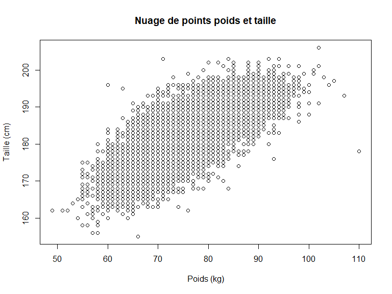

# Statistiques générales pour explorer un jeu de données

    fifa22 <- read.csv("https://raw.githubusercontent.com/agailloty/Outils-Analyses-R/main/dataset/fifa22.csv")

## Explorer le jeu de données

### Afficher la structure du jeu de données

    str(fifa22)

    'data.frame':   19239 obs. of  74 variables:
     $ short_name                 : chr  "L, Messi" "R, Lewandowski" "Cristiano Ronaldo" "Neymar Jr" ...
     $ player_positions           : chr  "RW, ST, CF" "ST" "ST, LW" "LW, CAM" ...
     $ overall                    : int  93 92 91 91 91 91 91 90 90 90 ...
     $ potential                  : int  93 92 91 91 91 93 95 90 92 90 ...
     $ value_eur                  : num  7.80e+07 1.20e+08 4.50e+07 1.29e+08 1.26e+08 ...
     $ wage_eur                   : num  320000 270000 270000 270000 350000 130000 230000 86000 250000 240000 ...
     $ age                        : int  34 32 36 29 30 28 22 35 29 27 ...
     $ dob                        : chr  "1987-06-24" "1988-08-21" "1985-02-05" "1992-02-05" ...
     $ height_cm                  : int  170 185 187 175 181 188 182 193 187 188 ...
     $ weight_kg                  : int  72 81 83 68 70 87 73 93 85 89 ...
     $ club_team_id               : int  73 21 11 73 10 240 73 21 241 18 ...
     $ club_name                  : chr  "Paris Saint-Germain" "FC Bayern München" "Manchester United" "Paris Saint-Germain" ...
     $ league_name                : chr  "French Ligue 1" "German 1, Bundesliga" "English Premier League" "French Ligue 1" ...
     $ league_level               : int  1 1 1 1 1 1 1 1 1 1 ...
     $ club_position              : chr  "RW" "ST" "ST" "LW" ...
     $ club_jersey_number         : int  30 9 7 10 17 13 7 1 1 10 ...
     $ club_loaned_from           : chr  NA NA NA NA ...
     $ club_joined                : chr  "2021-08-10" "2014-07-01" "2021-08-27" "2017-08-03" ...
     $ club_contract_valid_until  : int  2023 2023 2023 2025 2025 2023 2022 2023 2025 2024 ...
     $ nationality_id             : int  52 37 38 54 7 44 18 21 21 14 ...
     $ nationality_name           : chr  "Argentina" "Poland" "Portugal" "Brazil" ...
     $ nation_team_id             : int  1369 1353 1354 NA 1325 NA 1335 1337 NA 1318 ...
     $ nation_position            : chr  "RW" "RS" "ST" NA ...
     $ nation_jersey_number       : int  10 9 7 NA 7 NA 10 1 NA 9 ...
     $ preferred_foot             : chr  "Left" "Right" "Right" "Right" ...
     $ weak_foot                  : int  4 4 4 5 5 3 4 4 4 5 ...
     $ skill_moves                : int  4 4 5 5 4 1 5 1 1 3 ...
     $ international_reputation   : int  5 5 5 5 4 5 4 5 4 4 ...
     $ work_rate                  : chr  "Medium/Low" "High/Medium" "High/Low" "High/Medium" ...
     $ body_type                  : chr  "Unique" "Unique" "Unique" "Unique" ...
     $ real_face                  : chr  "Yes" "Yes" "Yes" "Yes" ...
     $ release_clause_eur         : num  1.44e+08 1.97e+08 8.33e+07 2.39e+08 2.32e+08 ...
     $ player_traits              : chr  "Finesse Shot, Long Shot Taker (AI), Playmaker (AI), Outside Foot Shot, One Club Player, Chip Shot (AI), Technic"| __truncated__ "Solid Player, Finesse Shot, Outside Foot Shot, Chip Shot (AI)" "Power Free-Kick, Flair, Long Shot Taker (AI), Speed Dribbler (AI), Outside Foot Shot" "Injury Prone, Flair, Speed Dribbler (AI), Playmaker (AI), Outside Foot Shot, Technical Dribbler (AI)" ...
     $ pace                       : int  85 78 87 91 76 NA 97 NA NA 70 ...
     $ shooting                   : int  92 92 94 83 86 NA 88 NA NA 91 ...
     $ passing                    : int  91 79 80 86 93 NA 80 NA NA 83 ...
     $ dribbling                  : int  95 86 88 94 88 NA 92 NA NA 83 ...
     $ defending                  : int  34 44 34 37 64 NA 36 NA NA 47 ...
     $ physic                     : int  65 82 75 63 78 NA 77 NA NA 83 ...
     $ attacking_crossing         : int  85 71 87 85 94 13 78 15 18 80 ...
     $ attacking_finishing        : int  95 95 95 83 82 11 93 13 14 94 ...
     $ attacking_heading_accuracy : int  70 90 90 63 55 15 72 25 11 86 ...
     $ attacking_short_passing    : int  91 85 80 86 94 43 85 60 61 85 ...
     $ attacking_volleys          : int  88 89 86 86 82 13 83 11 14 88 ...
     $ skill_dribbling            : int  96 85 88 95 88 12 93 30 21 83 ...
     $ skill_curve                : int  93 79 81 88 85 13 80 14 18 83 ...
     $ skill_fk_accuracy          : int  94 85 84 87 83 14 69 11 12 65 ...
     $ skill_long_passing         : int  91 70 77 81 93 40 71 68 63 86 ...
     $ skill_ball_control         : int  96 88 88 95 91 30 91 46 30 85 ...
     $ movement_acceleration      : int  91 77 85 93 76 43 97 54 38 65 ...
     $ movement_sprint_speed      : int  80 79 88 89 76 60 97 60 50 74 ...
     $ movement_agility           : int  91 77 86 96 79 67 92 51 39 71 ...
     $ movement_reactions         : int  94 93 94 89 91 88 93 87 86 92 ...
     $ movement_balance           : int  95 82 74 84 78 49 83 35 43 70 ...
     $ power_shot_power           : int  86 90 94 80 91 59 86 68 66 91 ...
     $ power_jumping              : int  68 85 95 64 63 78 78 77 79 79 ...
     $ power_stamina              : int  72 76 77 81 89 41 88 43 35 83 ...
     $ power_strength             : int  69 86 77 53 74 78 77 80 78 85 ...
     $ power_long_shots           : int  94 87 93 81 91 12 82 16 10 86 ...
     $ mentality_aggression       : int  44 81 63 63 76 34 62 29 43 80 ...
     $ mentality_interceptions    : int  40 49 29 37 66 19 38 30 22 44 ...
     $ mentality_positioning      : int  93 95 95 86 88 11 92 12 11 94 ...
     $ mentality_vision           : int  95 81 76 90 94 65 82 70 70 87 ...
     $ mentality_penalties        : int  75 90 88 93 83 11 79 47 25 91 ...
     $ mentality_composure        : int  96 88 95 93 89 68 88 70 70 91 ...
     $ defending_marking_awareness: int  20 35 24 35 68 27 26 17 25 50 ...
     $ defending_standing_tackle  : int  35 42 32 32 65 12 34 10 13 36 ...
     $ defending_sliding_tackle   : int  24 19 24 29 53 18 32 11 10 38 ...
     $ goalkeeping_diving         : int  6 15 7 9 15 87 13 88 88 8 ...
     $ goalkeeping_handling       : int  11 6 11 9 13 92 5 88 85 10 ...
     $ goalkeeping_kicking        : int  15 12 15 15 5 78 7 91 88 11 ...
     $ goalkeeping_positioning    : int  14 8 14 15 10 90 11 89 88 14 ...
     $ goalkeeping_reflexes       : int  8 10 11 11 13 90 6 88 90 11 ...
     $ goalkeeping_speed          : int  NA NA NA NA NA 50 NA 56 43 NA ...

### Afficher toutes les colonnes

    colnames(fifa22)

     [1] "short_name"                  "player_positions"           
     [3] "overall"                     "potential"                  
     [5] "value_eur"                   "wage_eur"                   
     [7] "age"                         "dob"                        
     [9] "height_cm"                   "weight_kg"                  
    [11] "club_team_id"                "club_name"                  
    [13] "league_name"                 "league_level"               
    [15] "club_position"               "club_jersey_number"         
    [17] "club_loaned_from"            "club_joined"                
    [19] "club_contract_valid_until"   "nationality_id"             
    [21] "nationality_name"            "nation_team_id"             
    [23] "nation_position"             "nation_jersey_number"       
    [25] "preferred_foot"              "weak_foot"                  
    [27] "skill_moves"                 "international_reputation"   
    [29] "work_rate"                   "body_type"                  
    [31] "real_face"                   "release_clause_eur"         
    [33] "player_traits"               "pace"                       
    [35] "shooting"                    "passing"                    
    [37] "dribbling"                   "defending"                  
    [39] "physic"                      "attacking_crossing"         
    [41] "attacking_finishing"         "attacking_heading_accuracy" 
    [43] "attacking_short_passing"     "attacking_volleys"          
    [45] "skill_dribbling"             "skill_curve"                
    [47] "skill_fk_accuracy"           "skill_long_passing"         
    [49] "skill_ball_control"          "movement_acceleration"      
    [51] "movement_sprint_speed"       "movement_agility"           
    [53] "movement_reactions"          "movement_balance"           
    [55] "power_shot_power"            "power_jumping"              
    [57] "power_stamina"               "power_strength"             
    [59] "power_long_shots"            "mentality_aggression"       
    [61] "mentality_interceptions"     "mentality_positioning"      
    [63] "mentality_vision"            "mentality_penalties"        
    [65] "mentality_composure"         "defending_marking_awareness"
    [67] "defending_standing_tackle"   "defending_sliding_tackle"   
    [69] "goalkeeping_diving"          "goalkeeping_handling"       
    [71] "goalkeeping_kicking"         "goalkeeping_positioning"    
    [73] "goalkeeping_reflexes"        "goalkeeping_speed"          

### Afficher les colonnes numériques

    colnames(fifa22)[sapply(fifa22, is.numeric)]

     [1] "overall"                     "potential"                  
     [3] "value_eur"                   "wage_eur"                   
     [5] "age"                         "height_cm"                  
     [7] "weight_kg"                   "club_team_id"               
     [9] "league_level"                "club_jersey_number"         
    [11] "club_contract_valid_until"   "nationality_id"             
    [13] "nation_team_id"              "nation_jersey_number"       
    [15] "weak_foot"                   "skill_moves"                
    [17] "international_reputation"    "release_clause_eur"         
    [19] "pace"                        "shooting"                   
    [21] "passing"                     "dribbling"                  
    [23] "defending"                   "physic"                     
    [25] "attacking_crossing"          "attacking_finishing"        
    [27] "attacking_heading_accuracy"  "attacking_short_passing"    
    [29] "attacking_volleys"           "skill_dribbling"            
    [31] "skill_curve"                 "skill_fk_accuracy"          
    [33] "skill_long_passing"          "skill_ball_control"         
    [35] "movement_acceleration"       "movement_sprint_speed"      
    [37] "movement_agility"            "movement_reactions"         
    [39] "movement_balance"            "power_shot_power"           
    [41] "power_jumping"               "power_stamina"              
    [43] "power_strength"              "power_long_shots"           
    [45] "mentality_aggression"        "mentality_interceptions"    
    [47] "mentality_positioning"       "mentality_vision"           
    [49] "mentality_penalties"         "mentality_composure"        
    [51] "defending_marking_awareness" "defending_standing_tackle"  
    [53] "defending_sliding_tackle"    "goalkeeping_diving"         
    [55] "goalkeeping_handling"        "goalkeeping_kicking"        
    [57] "goalkeeping_positioning"     "goalkeeping_reflexes"       
    [59] "goalkeeping_speed"          

Ou bien

    library(dplyr)

    Attachement du package : 'dplyr'

    Les objets suivants sont masqués depuis 'package:stats':

        filter, lag

    Les objets suivants sont masqués depuis 'package:base':

        intersect, setdiff, setequal, union

    colnames(select(fifa22, where(is.numeric)))

     [1] "overall"                     "potential"                  
     [3] "value_eur"                   "wage_eur"                   
     [5] "age"                         "height_cm"                  
     [7] "weight_kg"                   "club_team_id"               
     [9] "league_level"                "club_jersey_number"         
    [11] "club_contract_valid_until"   "nationality_id"             
    [13] "nation_team_id"              "nation_jersey_number"       
    [15] "weak_foot"                   "skill_moves"                
    [17] "international_reputation"    "release_clause_eur"         
    [19] "pace"                        "shooting"                   
    [21] "passing"                     "dribbling"                  
    [23] "defending"                   "physic"                     
    [25] "attacking_crossing"          "attacking_finishing"        
    [27] "attacking_heading_accuracy"  "attacking_short_passing"    
    [29] "attacking_volleys"           "skill_dribbling"            
    [31] "skill_curve"                 "skill_fk_accuracy"          
    [33] "skill_long_passing"          "skill_ball_control"         
    [35] "movement_acceleration"       "movement_sprint_speed"      
    [37] "movement_agility"            "movement_reactions"         
    [39] "movement_balance"            "power_shot_power"           
    [41] "power_jumping"               "power_stamina"              
    [43] "power_strength"              "power_long_shots"           
    [45] "mentality_aggression"        "mentality_interceptions"    
    [47] "mentality_positioning"       "mentality_vision"           
    [49] "mentality_penalties"         "mentality_composure"        
    [51] "defending_marking_awareness" "defending_standing_tackle"  
    [53] "defending_sliding_tackle"    "goalkeeping_diving"         
    [55] "goalkeeping_handling"        "goalkeeping_kicking"        
    [57] "goalkeeping_positioning"     "goalkeeping_reflexes"       
    [59] "goalkeeping_speed"          

### Des colonnes non numériques

    colnames(fifa22)[sapply(fifa22, is.character)]

     [1] "short_name"       "player_positions" "dob"              "club_name"       
     [5] "league_name"      "club_position"    "club_loaned_from" "club_joined"     
     [9] "nationality_name" "nation_position"  "preferred_foot"   "work_rate"       
    [13] "body_type"        "real_face"        "player_traits"   

    colnames(select(fifa22, where(is.character)))

     [1] "short_name"       "player_positions" "dob"              "club_name"       
     [5] "league_name"      "club_position"    "club_loaned_from" "club_joined"     
     [9] "nationality_name" "nation_position"  "preferred_foot"   "work_rate"       
    [13] "body_type"        "real_face"        "player_traits"   

## Statistiques groupées

    aggregate(wage_eur ~ league_name, data=fifa22, FUN = mean)

<table>
<thead>
<tr class="header">
<th style="text-align: left;">league_name</th>
<th style="text-align: right;">wage_eur</th>
</tr>
</thead>
<tbody>
<tr class="odd">
<td style="text-align: left;">Argentina Primera División</td>
<td style="text-align: right;">6140.9904</td>
</tr>
<tr class="even">
<td style="text-align: left;">Australian Hyundai A-League</td>
<td style="text-align: right;">1638.4477</td>
</tr>
<tr class="odd">
<td style="text-align: left;">Austrian Football Bundesliga</td>
<td style="text-align: right;">5206.2121</td>
</tr>
<tr class="even">
<td style="text-align: left;">Belgian Jupiler Pro League</td>
<td style="text-align: right;">7422.7459</td>
</tr>
<tr class="odd">
<td style="text-align: left;">Campeonato Brasileiro Série A</td>
<td style="text-align: right;">15263.8889</td>
</tr>
<tr class="even">
<td style="text-align: left;">Chilian Campeonato Nacional</td>
<td style="text-align: right;">2016.4516</td>
</tr>
<tr class="odd">
<td style="text-align: left;">Chinese Super League</td>
<td style="text-align: right;">4255.8296</td>
</tr>
<tr class="even">
<td style="text-align: left;">Colombian Liga Postobón</td>
<td style="text-align: right;">951.0471</td>
</tr>
<tr class="odd">
<td style="text-align: left;">Croatian Prva HNL</td>
<td style="text-align: right;">591.0714</td>
</tr>
<tr class="even">
<td style="text-align: left;">Cypriot First Division</td>
<td style="text-align: right;">601.7857</td>
</tr>
<tr class="odd">
<td style="text-align: left;">Czech Republic Gambrinus Liga</td>
<td style="text-align: right;">739.2405</td>
</tr>
<tr class="even">
<td style="text-align: left;">Danish Superliga</td>
<td style="text-align: right;">4234.2767</td>
</tr>
<tr class="odd">
<td style="text-align: left;">Ecuadorian Serie A</td>
<td style="text-align: right;">550.0000</td>
</tr>
<tr class="even">
<td style="text-align: left;">English League Championship</td>
<td style="text-align: right;">11440.9344</td>
</tr>
<tr class="odd">
<td style="text-align: left;">English League One</td>
<td style="text-align: right;">2879.3131</td>
</tr>
<tr class="even">
<td style="text-align: left;">English League Two</td>
<td style="text-align: right;">2592.9853</td>
</tr>
<tr class="odd">
<td style="text-align: left;">English National League</td>
<td style="text-align: right;">500.0000</td>
</tr>
<tr class="even">
<td style="text-align: left;">English Premier League</td>
<td style="text-align: right;">50847.6994</td>
</tr>
<tr class="odd">
<td style="text-align: left;">Finnish Veikkausliiga</td>
<td style="text-align: right;">500.0000</td>
</tr>
<tr class="even">
<td style="text-align: left;">French Ligue 1</td>
<td style="text-align: right;">21462.7383</td>
</tr>
<tr class="odd">
<td style="text-align: left;">French Ligue 2</td>
<td style="text-align: right;">2242.2495</td>
</tr>
<tr class="even">
<td style="text-align: left;">German 1, Bundesliga</td>
<td style="text-align: right;">24407.7132</td>
</tr>
<tr class="odd">
<td style="text-align: left;">German 2, Bundesliga</td>
<td style="text-align: right;">6136.1765</td>
</tr>
<tr class="even">
<td style="text-align: left;">German 3, Bundesliga</td>
<td style="text-align: right;">1229.4280</td>
</tr>
<tr class="odd">
<td style="text-align: left;">Greek Super League</td>
<td style="text-align: right;">804.4643</td>
</tr>
<tr class="even">
<td style="text-align: left;">Holland Eredivisie</td>
<td style="text-align: right;">5058.0285</td>
</tr>
<tr class="odd">
<td style="text-align: left;">Hungarian Nemzeti Bajnokság I</td>
<td style="text-align: right;">617.8571</td>
</tr>
<tr class="even">
<td style="text-align: left;">Indian Super League</td>
<td style="text-align: right;">606.6308</td>
</tr>
<tr class="odd">
<td style="text-align: left;">Italian Serie A</td>
<td style="text-align: right;">31004.5293</td>
</tr>
<tr class="even">
<td style="text-align: left;">Italian Serie B</td>
<td style="text-align: right;">5298.1061</td>
</tr>
<tr class="odd">
<td style="text-align: left;">Japanese J, League Division 1</td>
<td style="text-align: right;">2664.6010</td>
</tr>
<tr class="even">
<td style="text-align: left;">Korean K League 1</td>
<td style="text-align: right;">2326.1905</td>
</tr>
<tr class="odd">
<td style="text-align: left;">Liga de Fútbol Profesional Boliviano</td>
<td style="text-align: right;">516.8449</td>
</tr>
<tr class="even">
<td style="text-align: left;">Mexican Liga MX</td>
<td style="text-align: right;">12220.0820</td>
</tr>
<tr class="odd">
<td style="text-align: left;">Norwegian Eliteserien</td>
<td style="text-align: right;">1415.7107</td>
</tr>
<tr class="even">
<td style="text-align: left;">Paraguayan Primera División</td>
<td style="text-align: right;">575.5747</td>
</tr>
<tr class="odd">
<td style="text-align: left;">Peruvian Primera División</td>
<td style="text-align: right;">511.0429</td>
</tr>
<tr class="even">
<td style="text-align: left;">Polish T-Mobile Ekstraklasa</td>
<td style="text-align: right;">2034.6774</td>
</tr>
<tr class="odd">
<td style="text-align: left;">Portuguese Liga ZON SAGRES</td>
<td style="text-align: right;">6335.8416</td>
</tr>
<tr class="even">
<td style="text-align: left;">Rep, Ireland Airtricity League</td>
<td style="text-align: right;">619.7674</td>
</tr>
<tr class="odd">
<td style="text-align: left;">Romanian Liga I</td>
<td style="text-align: right;">2616.7421</td>
</tr>
<tr class="even">
<td style="text-align: left;">Russian Premier League</td>
<td style="text-align: right;">24213.4146</td>
</tr>
<tr class="odd">
<td style="text-align: left;">Saudi Abdul L, Jameel League</td>
<td style="text-align: right;">8381.0897</td>
</tr>
<tr class="even">
<td style="text-align: left;">Scottish Premiership</td>
<td style="text-align: right;">6782.5000</td>
</tr>
<tr class="odd">
<td style="text-align: left;">South African Premier Division</td>
<td style="text-align: right;">552.6786</td>
</tr>
<tr class="even">
<td style="text-align: left;">Spain Primera Division</td>
<td style="text-align: right;">31128.8310</td>
</tr>
<tr class="odd">
<td style="text-align: left;">Spanish Segunda División</td>
<td style="text-align: right;">4734.3200</td>
</tr>
<tr class="even">
<td style="text-align: left;">Swedish Allsvenskan</td>
<td style="text-align: right;">1553.5623</td>
</tr>
<tr class="odd">
<td style="text-align: left;">Swiss Super League</td>
<td style="text-align: right;">5498.7037</td>
</tr>
<tr class="even">
<td style="text-align: left;">Turkish Süper Lig</td>
<td style="text-align: right;">11915.1013</td>
</tr>
<tr class="odd">
<td style="text-align: left;">UAE Arabian Gulf League</td>
<td style="text-align: right;">580.3571</td>
</tr>
<tr class="even">
<td style="text-align: left;">Ukrainian Premier League</td>
<td style="text-align: right;">716.9643</td>
</tr>
<tr class="odd">
<td style="text-align: left;">Uruguayan Primera División</td>
<td style="text-align: right;">540.5303</td>
</tr>
<tr class="even">
<td style="text-align: left;">USA Major League Soccer</td>
<td style="text-align: right;">3255.3178</td>
</tr>
<tr class="odd">
<td style="text-align: left;">Venezuelan Primera División</td>
<td style="text-align: right;">500.9317</td>
</tr>
</tbody>
</table>

    salaire_moyen_league <- aggregate(wage_eur ~ league_name, data=fifa22, FUN = mean)
    arrange(salaire_moyen_league, -wage_eur)

<table>
<thead>
<tr class="header">
<th style="text-align: left;">league_name</th>
<th style="text-align: right;">wage_eur</th>
</tr>
</thead>
<tbody>
<tr class="odd">
<td style="text-align: left;">English Premier League</td>
<td style="text-align: right;">50847.6994</td>
</tr>
<tr class="even">
<td style="text-align: left;">Spain Primera Division</td>
<td style="text-align: right;">31128.8310</td>
</tr>
<tr class="odd">
<td style="text-align: left;">Italian Serie A</td>
<td style="text-align: right;">31004.5293</td>
</tr>
<tr class="even">
<td style="text-align: left;">German 1, Bundesliga</td>
<td style="text-align: right;">24407.7132</td>
</tr>
<tr class="odd">
<td style="text-align: left;">Russian Premier League</td>
<td style="text-align: right;">24213.4146</td>
</tr>
<tr class="even">
<td style="text-align: left;">French Ligue 1</td>
<td style="text-align: right;">21462.7383</td>
</tr>
<tr class="odd">
<td style="text-align: left;">Campeonato Brasileiro Série A</td>
<td style="text-align: right;">15263.8889</td>
</tr>
<tr class="even">
<td style="text-align: left;">Mexican Liga MX</td>
<td style="text-align: right;">12220.0820</td>
</tr>
<tr class="odd">
<td style="text-align: left;">Turkish Süper Lig</td>
<td style="text-align: right;">11915.1013</td>
</tr>
<tr class="even">
<td style="text-align: left;">English League Championship</td>
<td style="text-align: right;">11440.9344</td>
</tr>
<tr class="odd">
<td style="text-align: left;">Saudi Abdul L, Jameel League</td>
<td style="text-align: right;">8381.0897</td>
</tr>
<tr class="even">
<td style="text-align: left;">Belgian Jupiler Pro League</td>
<td style="text-align: right;">7422.7459</td>
</tr>
<tr class="odd">
<td style="text-align: left;">Scottish Premiership</td>
<td style="text-align: right;">6782.5000</td>
</tr>
<tr class="even">
<td style="text-align: left;">Portuguese Liga ZON SAGRES</td>
<td style="text-align: right;">6335.8416</td>
</tr>
<tr class="odd">
<td style="text-align: left;">Argentina Primera División</td>
<td style="text-align: right;">6140.9904</td>
</tr>
<tr class="even">
<td style="text-align: left;">German 2, Bundesliga</td>
<td style="text-align: right;">6136.1765</td>
</tr>
<tr class="odd">
<td style="text-align: left;">Swiss Super League</td>
<td style="text-align: right;">5498.7037</td>
</tr>
<tr class="even">
<td style="text-align: left;">Italian Serie B</td>
<td style="text-align: right;">5298.1061</td>
</tr>
<tr class="odd">
<td style="text-align: left;">Austrian Football Bundesliga</td>
<td style="text-align: right;">5206.2121</td>
</tr>
<tr class="even">
<td style="text-align: left;">Holland Eredivisie</td>
<td style="text-align: right;">5058.0285</td>
</tr>
<tr class="odd">
<td style="text-align: left;">Spanish Segunda División</td>
<td style="text-align: right;">4734.3200</td>
</tr>
<tr class="even">
<td style="text-align: left;">Chinese Super League</td>
<td style="text-align: right;">4255.8296</td>
</tr>
<tr class="odd">
<td style="text-align: left;">Danish Superliga</td>
<td style="text-align: right;">4234.2767</td>
</tr>
<tr class="even">
<td style="text-align: left;">USA Major League Soccer</td>
<td style="text-align: right;">3255.3178</td>
</tr>
<tr class="odd">
<td style="text-align: left;">English League One</td>
<td style="text-align: right;">2879.3131</td>
</tr>
<tr class="even">
<td style="text-align: left;">Japanese J, League Division 1</td>
<td style="text-align: right;">2664.6010</td>
</tr>
<tr class="odd">
<td style="text-align: left;">Romanian Liga I</td>
<td style="text-align: right;">2616.7421</td>
</tr>
<tr class="even">
<td style="text-align: left;">English League Two</td>
<td style="text-align: right;">2592.9853</td>
</tr>
<tr class="odd">
<td style="text-align: left;">Korean K League 1</td>
<td style="text-align: right;">2326.1905</td>
</tr>
<tr class="even">
<td style="text-align: left;">French Ligue 2</td>
<td style="text-align: right;">2242.2495</td>
</tr>
<tr class="odd">
<td style="text-align: left;">Polish T-Mobile Ekstraklasa</td>
<td style="text-align: right;">2034.6774</td>
</tr>
<tr class="even">
<td style="text-align: left;">Chilian Campeonato Nacional</td>
<td style="text-align: right;">2016.4516</td>
</tr>
<tr class="odd">
<td style="text-align: left;">Australian Hyundai A-League</td>
<td style="text-align: right;">1638.4477</td>
</tr>
<tr class="even">
<td style="text-align: left;">Swedish Allsvenskan</td>
<td style="text-align: right;">1553.5623</td>
</tr>
<tr class="odd">
<td style="text-align: left;">Norwegian Eliteserien</td>
<td style="text-align: right;">1415.7107</td>
</tr>
<tr class="even">
<td style="text-align: left;">German 3, Bundesliga</td>
<td style="text-align: right;">1229.4280</td>
</tr>
<tr class="odd">
<td style="text-align: left;">Colombian Liga Postobón</td>
<td style="text-align: right;">951.0471</td>
</tr>
<tr class="even">
<td style="text-align: left;">Greek Super League</td>
<td style="text-align: right;">804.4643</td>
</tr>
<tr class="odd">
<td style="text-align: left;">Czech Republic Gambrinus Liga</td>
<td style="text-align: right;">739.2405</td>
</tr>
<tr class="even">
<td style="text-align: left;">Ukrainian Premier League</td>
<td style="text-align: right;">716.9643</td>
</tr>
<tr class="odd">
<td style="text-align: left;">Rep, Ireland Airtricity League</td>
<td style="text-align: right;">619.7674</td>
</tr>
<tr class="even">
<td style="text-align: left;">Hungarian Nemzeti Bajnokság I</td>
<td style="text-align: right;">617.8571</td>
</tr>
<tr class="odd">
<td style="text-align: left;">Indian Super League</td>
<td style="text-align: right;">606.6308</td>
</tr>
<tr class="even">
<td style="text-align: left;">Cypriot First Division</td>
<td style="text-align: right;">601.7857</td>
</tr>
<tr class="odd">
<td style="text-align: left;">Croatian Prva HNL</td>
<td style="text-align: right;">591.0714</td>
</tr>
<tr class="even">
<td style="text-align: left;">UAE Arabian Gulf League</td>
<td style="text-align: right;">580.3571</td>
</tr>
<tr class="odd">
<td style="text-align: left;">Paraguayan Primera División</td>
<td style="text-align: right;">575.5747</td>
</tr>
<tr class="even">
<td style="text-align: left;">South African Premier Division</td>
<td style="text-align: right;">552.6786</td>
</tr>
<tr class="odd">
<td style="text-align: left;">Ecuadorian Serie A</td>
<td style="text-align: right;">550.0000</td>
</tr>
<tr class="even">
<td style="text-align: left;">Uruguayan Primera División</td>
<td style="text-align: right;">540.5303</td>
</tr>
<tr class="odd">
<td style="text-align: left;">Liga de Fútbol Profesional Boliviano</td>
<td style="text-align: right;">516.8449</td>
</tr>
<tr class="even">
<td style="text-align: left;">Peruvian Primera División</td>
<td style="text-align: right;">511.0429</td>
</tr>
<tr class="odd">
<td style="text-align: left;">Venezuelan Primera División</td>
<td style="text-align: right;">500.9317</td>
</tr>
<tr class="even">
<td style="text-align: left;">English National League</td>
<td style="text-align: right;">500.0000</td>
</tr>
<tr class="odd">
<td style="text-align: left;">Finnish Veikkausliiga</td>
<td style="text-align: right;">500.0000</td>
</tr>
</tbody>
</table>

    aggregate(wage_eur ~ league_name + international_reputation, data=fifa22, FUN = mean)

<table>
<colgroup>
<col style="width: 50%" />
<col style="width: 33%" />
<col style="width: 16%" />
</colgroup>
<thead>
<tr class="header">
<th style="text-align: left;">league_name</th>
<th style="text-align: right;">international_reputation</th>
<th style="text-align: right;">wage_eur</th>
</tr>
</thead>
<tbody>
<tr class="odd">
<td style="text-align: left;">Argentina Primera División</td>
<td style="text-align: right;">1</td>
<td style="text-align: right;">5883.0703</td>
</tr>
<tr class="even">
<td style="text-align: left;">Australian Hyundai A-League</td>
<td style="text-align: right;">1</td>
<td style="text-align: right;">1637.1377</td>
</tr>
<tr class="odd">
<td style="text-align: left;">Austrian Football Bundesliga</td>
<td style="text-align: right;">1</td>
<td style="text-align: right;">5119.4190</td>
</tr>
<tr class="even">
<td style="text-align: left;">Belgian Jupiler Pro League</td>
<td style="text-align: right;">1</td>
<td style="text-align: right;">7104.4492</td>
</tr>
<tr class="odd">
<td style="text-align: left;">Campeonato Brasileiro Série A</td>
<td style="text-align: right;">1</td>
<td style="text-align: right;">15263.8889</td>
</tr>
<tr class="even">
<td style="text-align: left;">Chilian Campeonato Nacional</td>
<td style="text-align: right;">1</td>
<td style="text-align: right;">2016.4516</td>
</tr>
<tr class="odd">
<td style="text-align: left;">Chinese Super League</td>
<td style="text-align: right;">1</td>
<td style="text-align: right;">3761.8056</td>
</tr>
<tr class="even">
<td style="text-align: left;">Colombian Liga Postobón</td>
<td style="text-align: right;">1</td>
<td style="text-align: right;">951.0471</td>
</tr>
<tr class="odd">
<td style="text-align: left;">Croatian Prva HNL</td>
<td style="text-align: right;">1</td>
<td style="text-align: right;">573.5849</td>
</tr>
<tr class="even">
<td style="text-align: left;">Cypriot First Division</td>
<td style="text-align: right;">1</td>
<td style="text-align: right;">600.0000</td>
</tr>
<tr class="odd">
<td style="text-align: left;">Czech Republic Gambrinus Liga</td>
<td style="text-align: right;">1</td>
<td style="text-align: right;">732.4675</td>
</tr>
<tr class="even">
<td style="text-align: left;">Danish Superliga</td>
<td style="text-align: right;">1</td>
<td style="text-align: right;">4235.0158</td>
</tr>
<tr class="odd">
<td style="text-align: left;">Ecuadorian Serie A</td>
<td style="text-align: right;">1</td>
<td style="text-align: right;">550.0000</td>
</tr>
<tr class="even">
<td style="text-align: left;">English League Championship</td>
<td style="text-align: right;">1</td>
<td style="text-align: right;">11311.3861</td>
</tr>
<tr class="odd">
<td style="text-align: left;">English League One</td>
<td style="text-align: right;">1</td>
<td style="text-align: right;">2870.9135</td>
</tr>
<tr class="even">
<td style="text-align: left;">English League Two</td>
<td style="text-align: right;">1</td>
<td style="text-align: right;">2593.9542</td>
</tr>
<tr class="odd">
<td style="text-align: left;">English National League</td>
<td style="text-align: right;">1</td>
<td style="text-align: right;">500.0000</td>
</tr>
<tr class="even">
<td style="text-align: left;">English Premier League</td>
<td style="text-align: right;">1</td>
<td style="text-align: right;">27107.5294</td>
</tr>
<tr class="odd">
<td style="text-align: left;">Finnish Veikkausliiga</td>
<td style="text-align: right;">1</td>
<td style="text-align: right;">500.0000</td>
</tr>
<tr class="even">
<td style="text-align: left;">French Ligue 1</td>
<td style="text-align: right;">1</td>
<td style="text-align: right;">11806.2954</td>
</tr>
<tr class="odd">
<td style="text-align: left;">French Ligue 2</td>
<td style="text-align: right;">1</td>
<td style="text-align: right;">2195.6480</td>
</tr>
<tr class="even">
<td style="text-align: left;">German 1, Bundesliga</td>
<td style="text-align: right;">1</td>
<td style="text-align: right;">12885.1389</td>
</tr>
<tr class="odd">
<td style="text-align: left;">German 2, Bundesliga</td>
<td style="text-align: right;">1</td>
<td style="text-align: right;">5948.6948</td>
</tr>
<tr class="even">
<td style="text-align: left;">German 3, Bundesliga</td>
<td style="text-align: right;">1</td>
<td style="text-align: right;">1225.1391</td>
</tr>
<tr class="odd">
<td style="text-align: left;">Greek Super League</td>
<td style="text-align: right;">1</td>
<td style="text-align: right;">758.5859</td>
</tr>
<tr class="even">
<td style="text-align: left;">Holland Eredivisie</td>
<td style="text-align: right;">1</td>
<td style="text-align: right;">4386.9612</td>
</tr>
<tr class="odd">
<td style="text-align: left;">Hungarian Nemzeti Bajnokság I</td>
<td style="text-align: right;">1</td>
<td style="text-align: right;">612.0000</td>
</tr>
<tr class="even">
<td style="text-align: left;">Indian Super League</td>
<td style="text-align: right;">1</td>
<td style="text-align: right;">606.6308</td>
</tr>
<tr class="odd">
<td style="text-align: left;">Italian Serie A</td>
<td style="text-align: right;">1</td>
<td style="text-align: right;">17530.3161</td>
</tr>
<tr class="even">
<td style="text-align: left;">Italian Serie B</td>
<td style="text-align: right;">1</td>
<td style="text-align: right;">4523.5537</td>
</tr>
<tr class="odd">
<td style="text-align: left;">Japanese J, League Division 1</td>
<td style="text-align: right;">1</td>
<td style="text-align: right;">2573.1643</td>
</tr>
<tr class="even">
<td style="text-align: left;">Korean K League 1</td>
<td style="text-align: right;">1</td>
<td style="text-align: right;">2248.7654</td>
</tr>
<tr class="odd">
<td style="text-align: left;">Liga de Fútbol Profesional Boliviano</td>
<td style="text-align: right;">1</td>
<td style="text-align: right;">516.8449</td>
</tr>
<tr class="even">
<td style="text-align: left;">Mexican Liga MX</td>
<td style="text-align: right;">1</td>
<td style="text-align: right;">12239.5062</td>
</tr>
<tr class="odd">
<td style="text-align: left;">Norwegian Eliteserien</td>
<td style="text-align: right;">1</td>
<td style="text-align: right;">1415.7107</td>
</tr>
<tr class="even">
<td style="text-align: left;">Paraguayan Primera División</td>
<td style="text-align: right;">1</td>
<td style="text-align: right;">575.5747</td>
</tr>
<tr class="odd">
<td style="text-align: left;">Peruvian Primera División</td>
<td style="text-align: right;">1</td>
<td style="text-align: right;">511.0429</td>
</tr>
<tr class="even">
<td style="text-align: left;">Polish T-Mobile Ekstraklasa</td>
<td style="text-align: right;">1</td>
<td style="text-align: right;">2020.6897</td>
</tr>
<tr class="odd">
<td style="text-align: left;">Portuguese Liga ZON SAGRES</td>
<td style="text-align: right;">1</td>
<td style="text-align: right;">5616.3180</td>
</tr>
<tr class="even">
<td style="text-align: left;">Rep, Ireland Airtricity League</td>
<td style="text-align: right;">1</td>
<td style="text-align: right;">619.7674</td>
</tr>
<tr class="odd">
<td style="text-align: left;">Romanian Liga I</td>
<td style="text-align: right;">1</td>
<td style="text-align: right;">2616.7421</td>
</tr>
<tr class="even">
<td style="text-align: left;">Russian Premier League</td>
<td style="text-align: right;">1</td>
<td style="text-align: right;">21711.2676</td>
</tr>
<tr class="odd">
<td style="text-align: left;">Saudi Abdul L, Jameel League</td>
<td style="text-align: right;">1</td>
<td style="text-align: right;">6768.9773</td>
</tr>
<tr class="even">
<td style="text-align: left;">Scottish Premiership</td>
<td style="text-align: right;">1</td>
<td style="text-align: right;">6209.6154</td>
</tr>
<tr class="odd">
<td style="text-align: left;">South African Premier Division</td>
<td style="text-align: right;">1</td>
<td style="text-align: right;">553.6364</td>
</tr>
<tr class="even">
<td style="text-align: left;">Spain Primera Division</td>
<td style="text-align: right;">1</td>
<td style="text-align: right;">18324.0042</td>
</tr>
<tr class="odd">
<td style="text-align: left;">Spanish Segunda División</td>
<td style="text-align: right;">1</td>
<td style="text-align: right;">4627.5947</td>
</tr>
<tr class="even">
<td style="text-align: left;">Swedish Allsvenskan</td>
<td style="text-align: right;">1</td>
<td style="text-align: right;">1553.5623</td>
</tr>
<tr class="odd">
<td style="text-align: left;">Swiss Super League</td>
<td style="text-align: right;">1</td>
<td style="text-align: right;">5145.9302</td>
</tr>
<tr class="even">
<td style="text-align: left;">Turkish Süper Lig</td>
<td style="text-align: right;">1</td>
<td style="text-align: right;">9923.1915</td>
</tr>
<tr class="odd">
<td style="text-align: left;">UAE Arabian Gulf League</td>
<td style="text-align: right;">1</td>
<td style="text-align: right;">580.3571</td>
</tr>
<tr class="even">
<td style="text-align: left;">Ukrainian Premier League</td>
<td style="text-align: right;">1</td>
<td style="text-align: right;">681.0000</td>
</tr>
<tr class="odd">
<td style="text-align: left;">Uruguayan Primera División</td>
<td style="text-align: right;">1</td>
<td style="text-align: right;">540.5303</td>
</tr>
<tr class="even">
<td style="text-align: left;">USA Major League Soccer</td>
<td style="text-align: right;">1</td>
<td style="text-align: right;">2965.3103</td>
</tr>
<tr class="odd">
<td style="text-align: left;">Venezuelan Primera División</td>
<td style="text-align: right;">1</td>
<td style="text-align: right;">500.9317</td>
</tr>
<tr class="even">
<td style="text-align: left;">Argentina Primera División</td>
<td style="text-align: right;">2</td>
<td style="text-align: right;">12153.8462</td>
</tr>
<tr class="odd">
<td style="text-align: left;">Australian Hyundai A-League</td>
<td style="text-align: right;">2</td>
<td style="text-align: right;">2000.0000</td>
</tr>
<tr class="even">
<td style="text-align: left;">Austrian Football Bundesliga</td>
<td style="text-align: right;">2</td>
<td style="text-align: right;">14666.6667</td>
</tr>
<tr class="odd">
<td style="text-align: left;">Belgian Jupiler Pro League</td>
<td style="text-align: right;">2</td>
<td style="text-align: right;">14384.6154</td>
</tr>
<tr class="even">
<td style="text-align: left;">Chinese Super League</td>
<td style="text-align: right;">2</td>
<td style="text-align: right;">17727.2727</td>
</tr>
<tr class="odd">
<td style="text-align: left;">Croatian Prva HNL</td>
<td style="text-align: right;">2</td>
<td style="text-align: right;">900.0000</td>
</tr>
<tr class="even">
<td style="text-align: left;">Cypriot First Division</td>
<td style="text-align: right;">2</td>
<td style="text-align: right;">650.0000</td>
</tr>
<tr class="odd">
<td style="text-align: left;">Czech Republic Gambrinus Liga</td>
<td style="text-align: right;">2</td>
<td style="text-align: right;">1000.0000</td>
</tr>
<tr class="even">
<td style="text-align: left;">Danish Superliga</td>
<td style="text-align: right;">2</td>
<td style="text-align: right;">4000.0000</td>
</tr>
<tr class="odd">
<td style="text-align: left;">English League Championship</td>
<td style="text-align: right;">2</td>
<td style="text-align: right;">20666.6667</td>
</tr>
<tr class="even">
<td style="text-align: left;">English League One</td>
<td style="text-align: right;">2</td>
<td style="text-align: right;">5500.0000</td>
</tr>
<tr class="odd">
<td style="text-align: left;">English League Two</td>
<td style="text-align: right;">2</td>
<td style="text-align: right;">2000.0000</td>
</tr>
<tr class="even">
<td style="text-align: left;">English Premier League</td>
<td style="text-align: right;">2</td>
<td style="text-align: right;">68751.6779</td>
</tr>
<tr class="odd">
<td style="text-align: left;">French Ligue 1</td>
<td style="text-align: right;">2</td>
<td style="text-align: right;">34359.3750</td>
</tr>
<tr class="even">
<td style="text-align: left;">French Ligue 2</td>
<td style="text-align: right;">2</td>
<td style="text-align: right;">4181.8182</td>
</tr>
<tr class="odd">
<td style="text-align: left;">German 1, Bundesliga</td>
<td style="text-align: right;">2</td>
<td style="text-align: right;">36575.1634</td>
</tr>
<tr class="even">
<td style="text-align: left;">German 2, Bundesliga</td>
<td style="text-align: right;">2</td>
<td style="text-align: right;">13916.6667</td>
</tr>
<tr class="odd">
<td style="text-align: left;">German 3, Bundesliga</td>
<td style="text-align: right;">2</td>
<td style="text-align: right;">2000.0000</td>
</tr>
<tr class="even">
<td style="text-align: left;">Greek Super League</td>
<td style="text-align: right;">2</td>
<td style="text-align: right;">1200.0000</td>
</tr>
<tr class="odd">
<td style="text-align: left;">Holland Eredivisie</td>
<td style="text-align: right;">2</td>
<td style="text-align: right;">13772.7273</td>
</tr>
<tr class="even">
<td style="text-align: left;">Hungarian Nemzeti Bajnokság I</td>
<td style="text-align: right;">2</td>
<td style="text-align: right;">666.6667</td>
</tr>
<tr class="odd">
<td style="text-align: left;">Italian Serie A</td>
<td style="text-align: right;">2</td>
<td style="text-align: right;">42734.6939</td>
</tr>
<tr class="even">
<td style="text-align: left;">Italian Serie B</td>
<td style="text-align: right;">2</td>
<td style="text-align: right;">14750.0000</td>
</tr>
<tr class="odd">
<td style="text-align: left;">Japanese J, League Division 1</td>
<td style="text-align: right;">2</td>
<td style="text-align: right;">5700.0000</td>
</tr>
<tr class="even">
<td style="text-align: left;">Korean K League 1</td>
<td style="text-align: right;">2</td>
<td style="text-align: right;">4416.6667</td>
</tr>
<tr class="odd">
<td style="text-align: left;">Mexican Liga MX</td>
<td style="text-align: right;">2</td>
<td style="text-align: right;">7500.0000</td>
</tr>
<tr class="even">
<td style="text-align: left;">Polish T-Mobile Ekstraklasa</td>
<td style="text-align: right;">2</td>
<td style="text-align: right;">3500.0000</td>
</tr>
<tr class="odd">
<td style="text-align: left;">Portuguese Liga ZON SAGRES</td>
<td style="text-align: right;">2</td>
<td style="text-align: right;">20176.4706</td>
</tr>
<tr class="even">
<td style="text-align: left;">Russian Premier League</td>
<td style="text-align: right;">2</td>
<td style="text-align: right;">38750.0000</td>
</tr>
<tr class="odd">
<td style="text-align: left;">Saudi Abdul L, Jameel League</td>
<td style="text-align: right;">2</td>
<td style="text-align: right;">31960.0000</td>
</tr>
<tr class="even">
<td style="text-align: left;">Scottish Premiership</td>
<td style="text-align: right;">2</td>
<td style="text-align: right;">29125.0000</td>
</tr>
<tr class="odd">
<td style="text-align: left;">South African Premier Division</td>
<td style="text-align: right;">2</td>
<td style="text-align: right;">500.0000</td>
</tr>
<tr class="even">
<td style="text-align: left;">Spain Primera Division</td>
<td style="text-align: right;">2</td>
<td style="text-align: right;">43931.3725</td>
</tr>
<tr class="odd">
<td style="text-align: left;">Spanish Segunda División</td>
<td style="text-align: right;">2</td>
<td style="text-align: right;">8333.3333</td>
</tr>
<tr class="even">
<td style="text-align: left;">Swiss Super League</td>
<td style="text-align: right;">2</td>
<td style="text-align: right;">13090.9091</td>
</tr>
<tr class="odd">
<td style="text-align: left;">Turkish Süper Lig</td>
<td style="text-align: right;">2</td>
<td style="text-align: right;">20596.4912</td>
</tr>
<tr class="even">
<td style="text-align: left;">Ukrainian Premier League</td>
<td style="text-align: right;">2</td>
<td style="text-align: right;">1016.6667</td>
</tr>
<tr class="odd">
<td style="text-align: left;">USA Major League Soccer</td>
<td style="text-align: right;">2</td>
<td style="text-align: right;">6818.1818</td>
</tr>
<tr class="even">
<td style="text-align: left;">Argentina Primera División</td>
<td style="text-align: right;">3</td>
<td style="text-align: right;">12000.0000</td>
</tr>
<tr class="odd">
<td style="text-align: left;">Belgian Jupiler Pro League</td>
<td style="text-align: right;">3</td>
<td style="text-align: right;">27333.3333</td>
</tr>
<tr class="even">
<td style="text-align: left;">Chinese Super League</td>
<td style="text-align: right;">3</td>
<td style="text-align: right;">26000.0000</td>
</tr>
<tr class="odd">
<td style="text-align: left;">English League Championship</td>
<td style="text-align: right;">3</td>
<td style="text-align: right;">20000.0000</td>
</tr>
<tr class="even">
<td style="text-align: left;">English Premier League</td>
<td style="text-align: right;">3</td>
<td style="text-align: right;">127306.4516</td>
</tr>
<tr class="odd">
<td style="text-align: left;">French Ligue 1</td>
<td style="text-align: right;">3</td>
<td style="text-align: right;">65172.4138</td>
</tr>
<tr class="even">
<td style="text-align: left;">French Ligue 2</td>
<td style="text-align: right;">3</td>
<td style="text-align: right;">5000.0000</td>
</tr>
<tr class="odd">
<td style="text-align: left;">German 1, Bundesliga</td>
<td style="text-align: right;">3</td>
<td style="text-align: right;">67428.5714</td>
</tr>
<tr class="even">
<td style="text-align: left;">Greek Super League</td>
<td style="text-align: right;">3</td>
<td style="text-align: right;">1000.0000</td>
</tr>
<tr class="odd">
<td style="text-align: left;">Holland Eredivisie</td>
<td style="text-align: right;">3</td>
<td style="text-align: right;">24200.0000</td>
</tr>
<tr class="even">
<td style="text-align: left;">Italian Serie A</td>
<td style="text-align: right;">3</td>
<td style="text-align: right;">72672.1311</td>
</tr>
<tr class="odd">
<td style="text-align: left;">Italian Serie B</td>
<td style="text-align: right;">3</td>
<td style="text-align: right;">8000.0000</td>
</tr>
<tr class="even">
<td style="text-align: left;">Japanese J, League Division 1</td>
<td style="text-align: right;">3</td>
<td style="text-align: right;">3900.0000</td>
</tr>
<tr class="odd">
<td style="text-align: left;">Polish T-Mobile Ekstraklasa</td>
<td style="text-align: right;">3</td>
<td style="text-align: right;">6000.0000</td>
</tr>
<tr class="even">
<td style="text-align: left;">Portuguese Liga ZON SAGRES</td>
<td style="text-align: right;">3</td>
<td style="text-align: right;">17555.5556</td>
</tr>
<tr class="odd">
<td style="text-align: left;">Russian Premier League</td>
<td style="text-align: right;">3</td>
<td style="text-align: right;">44666.6667</td>
</tr>
<tr class="even">
<td style="text-align: left;">Saudi Abdul L, Jameel League</td>
<td style="text-align: right;">3</td>
<td style="text-align: right;">48333.3333</td>
</tr>
<tr class="odd">
<td style="text-align: left;">Spain Primera Division</td>
<td style="text-align: right;">3</td>
<td style="text-align: right;">82810.8108</td>
</tr>
<tr class="even">
<td style="text-align: left;">Swiss Super League</td>
<td style="text-align: right;">3</td>
<td style="text-align: right;">13000.0000</td>
</tr>
<tr class="odd">
<td style="text-align: left;">Turkish Süper Lig</td>
<td style="text-align: right;">3</td>
<td style="text-align: right;">39785.7143</td>
</tr>
<tr class="even">
<td style="text-align: left;">USA Major League Soccer</td>
<td style="text-align: right;">3</td>
<td style="text-align: right;">9727.2727</td>
</tr>
<tr class="odd">
<td style="text-align: left;">English Premier League</td>
<td style="text-align: right;">4</td>
<td style="text-align: right;">215000.0000</td>
</tr>
<tr class="even">
<td style="text-align: left;">French Ligue 1</td>
<td style="text-align: right;">4</td>
<td style="text-align: right;">126000.0000</td>
</tr>
<tr class="odd">
<td style="text-align: left;">German 1, Bundesliga</td>
<td style="text-align: right;">4</td>
<td style="text-align: right;">121250.0000</td>
</tr>
<tr class="even">
<td style="text-align: left;">Holland Eredivisie</td>
<td style="text-align: right;">4</td>
<td style="text-align: right;">29000.0000</td>
</tr>
<tr class="odd">
<td style="text-align: left;">Italian Serie A</td>
<td style="text-align: right;">4</td>
<td style="text-align: right;">98166.6667</td>
</tr>
<tr class="even">
<td style="text-align: left;">Italian Serie B</td>
<td style="text-align: right;">4</td>
<td style="text-align: right;">18000.0000</td>
</tr>
<tr class="odd">
<td style="text-align: left;">Japanese J, League Division 1</td>
<td style="text-align: right;">4</td>
<td style="text-align: right;">10000.0000</td>
</tr>
<tr class="even">
<td style="text-align: left;">Portuguese Liga ZON SAGRES</td>
<td style="text-align: right;">4</td>
<td style="text-align: right;">14000.0000</td>
</tr>
<tr class="odd">
<td style="text-align: left;">Spain Primera Division</td>
<td style="text-align: right;">4</td>
<td style="text-align: right;">210266.6667</td>
</tr>
<tr class="even">
<td style="text-align: left;">Turkish Süper Lig</td>
<td style="text-align: right;">4</td>
<td style="text-align: right;">37500.0000</td>
</tr>
<tr class="odd">
<td style="text-align: left;">USA Major League Soccer</td>
<td style="text-align: right;">4</td>
<td style="text-align: right;">14000.0000</td>
</tr>
<tr class="even">
<td style="text-align: left;">English Premier League</td>
<td style="text-align: right;">5</td>
<td style="text-align: right;">270000.0000</td>
</tr>
<tr class="odd">
<td style="text-align: left;">French Ligue 1</td>
<td style="text-align: right;">5</td>
<td style="text-align: right;">295000.0000</td>
</tr>
<tr class="even">
<td style="text-align: left;">German 1, Bundesliga</td>
<td style="text-align: right;">5</td>
<td style="text-align: right;">178000.0000</td>
</tr>
<tr class="odd">
<td style="text-align: left;">Italian Serie A</td>
<td style="text-align: right;">5</td>
<td style="text-align: right;">51000.0000</td>
</tr>
<tr class="even">
<td style="text-align: left;">Spain Primera Division</td>
<td style="text-align: right;">5</td>
<td style="text-align: right;">132500.0000</td>
</tr>
</tbody>
</table>

## Statistiques de plusieurs données numériques

    num_cols <- select(fifa22, overall, wage_eur, height_cm, age)
    summary(num_cols)

        overall         wage_eur        height_cm          age       
     Min.   :47.00   Min.   :   500   Min.   :155.0   Min.   :16.00  
     1st Qu.:61.00   1st Qu.:  1000   1st Qu.:176.0   1st Qu.:21.00  
     Median :66.00   Median :  3000   Median :181.0   Median :25.00  
     Mean   :65.77   Mean   :  9018   Mean   :181.3   Mean   :25.21  
     3rd Qu.:70.00   3rd Qu.:  8000   3rd Qu.:186.0   3rd Qu.:29.00  
     Max.   :93.00   Max.   :350000   Max.   :206.0   Max.   :54.00  
                     NA's   :61                                      

## Convertir toutes les colonnes non numériques en facteur

    non_num_cols <- colnames(select(fifa22, where(Negate(is.numeric))))
    fifa22[non_num_cols] <- lapply(fifa22[non_num_cols], factor)

## Statistiques descriptives de toutes les données non-numériques

    fac_cols <- select(fifa22, where(Negate(is.numeric)))
    summary(fac_cols)

            short_name    player_positions         dob       
     J, Rodríguez:   13   CB     : 2423    1992-02-29:  125  
     J, Hernández:    9   GK     : 2132    1996-02-29:  120  
     J, Brown    :    8   ST     : 1770    2000-02-29:   92  
     Paulinho    :    8   CDM, CM:  953    1988-02-29:   34  
     J, García   :    7   CM     :  726    1999-02-25:   13  
     J, González :    7   CM, CDM:  687    2000-01-14:   12  
     (Other)     :19187   (Other):10548    (Other)   :18843  
                        club_name                          league_name   
     Arsenal                 :   33   USA Major League Soccer    :  771  
     Borussia Mönchengladbach:   33   Argentina Primera División :  727  
     Brentford               :   33   English League Championship:  717  
     Brighton & Hove Albion  :   33   English Premier League     :  652  
     Burnley                 :   33   Spain Primera Division     :  633  
     (Other)                 :19013   (Other)                    :15678  
     NA's                    :   61   NA's                       :   61  
     club_position            club_loaned_from     club_joined     nationality_name
     SUB    :8299   Atalanta          :   14   2021-07-01: 1278   England  : 1719  
     RES    :3168   Sporting CP       :   14   2019-07-01:  807   Germany  : 1214  
     GK     : 701   Atlético de Madrid:   13   2018-07-01:  458   Spain    : 1086  
     LCB    : 701   Juventus          :   13   2020-07-01:  420   France   :  980  
     RCB    : 701   Manchester City   :   13   2017-07-01:  297   Argentina:  960  
     (Other):5608   (Other)           : 1035   (Other)   :14816   Brazil   :  897  
     NA's   :  61   NA's              :18137   NA's      : 1163   (Other)  :12383  
     nation_position preferred_foot         work_rate                body_type   
     SUB    :  396   Left : 4565    Medium/Medium:10015   Normal (170-185):6685  
     GK     :   33   Right:14674    High/Medium  : 3661   Normal (185+)   :4236  
     LCB    :   33                  Medium/High  : 1880   Lean (170-185)  :4086  
     RCB    :   33                  High/High    : 1099   Lean (185+)     :1938  
     LB     :   27                  Medium/Low   :  810   Normal (170-)   : 669  
     (Other):  237                  High/Low     :  808   Stocky (170-185): 560  
     NA's   :18480                  (Other)      :  966   (Other)         :1065  
     real_face                   player_traits 
     No :17019   Speed Dribbler (AI)    : 711  
     Yes: 2220   Injury Prone           : 449  
                 Technical Dribbler (AI): 436  
                 Dives Into Tackles (AI): 364  
                 Power Header           : 361  
                 (Other)                :7077  
                 NA's                   :9841  

## Calcul du coefficient de corrélation linéaire

    cor(fifa22$weight_kg, fifa22$height_cm)

    [1] 0.765465

    plot(fifa22$weight_kg, fifa22$height_cm, xlab = "Poids (kg)", ylab = "Taille (cm)", main = "Nuage de points poids et taille")

Ce graphique montre que le poids et la taille vont dans la même
direction.

    cor(fifa22[, c("height_cm", "weight_kg", "wage_eur", "potential", "skill_dribbling")])

                       height_cm   weight_kg wage_eur    potential skill_dribbling
    height_cm        1.000000000  0.76546497       NA  0.004403203      -0.4772269
    weight_kg        0.765464972  1.00000000       NA -0.016912415      -0.3973634
    wage_eur                  NA          NA        1           NA              NA
    potential        0.004403203 -0.01691241       NA  1.000000000       0.3113960
    skill_dribbling -0.477226949 -0.39736339       NA  0.311395974       1.0000000

S’il y a des données manquantes, R ignore le calcul du coefficient de
corrélation et renvoie la NA qui signifie Not AVailable. Il faut que les
observartions soient complètes pour que le coefficient de corrélation
soit calculé. Nous pouvons indiquer explicitement à R d’ignorer les
données et ne calculer le coefficient que sur les données complètes. On
utilise l’argument use = “complete.obs” pour indiquer que R ne prenne
les lignes qui n’ont pas de données manquantes.

    cor(fifa22[, c("height_cm", "weight_kg", "wage_eur", "potential", "skill_dribbling")], 
        use = "complete.obs")

                      height_cm   weight_kg   wage_eur   potential skill_dribbling
    height_cm        1.00000000  0.76529382 0.02806235  0.00409139      -0.4769262
    weight_kg        0.76529382  1.00000000 0.06620795 -0.01730122      -0.3969755
    wage_eur         0.02806235  0.06620795 1.00000000  0.49761083       0.2552045
    potential        0.00409139 -0.01730122 0.49761083  1.00000000       0.3119857
    skill_dribbling -0.47692620 -0.39697551 0.25520447  0.31198571       1.0000000
